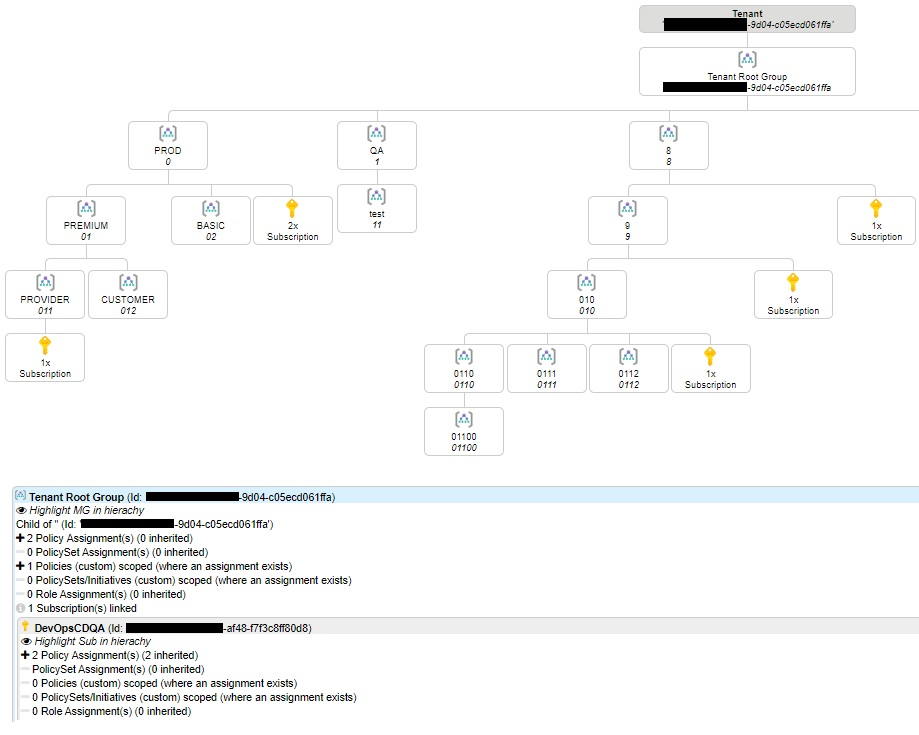
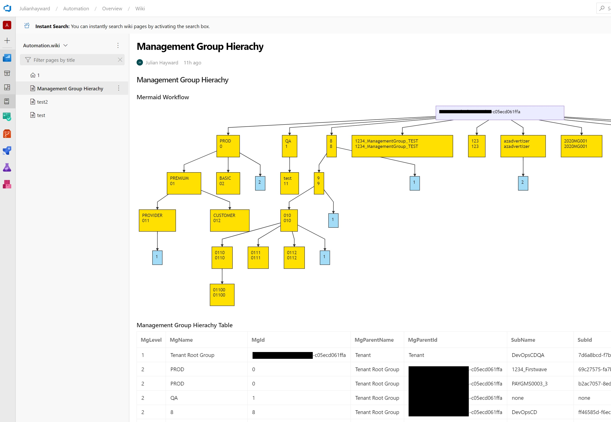

# Azure-MG-Sub-Governance-Reporting

..want to have visibility on your Management Group hierarchy, document it in markdown? This script iterates Management Group hierachy down to Subscription level capturing RBAC, Policies and Policy Initiatives.

## Required permissions in Azure on Root Management Group

* RBAC: _Management Group Reader_
* RBAC: _Reader_

## Powershell requirements

* PowerShell Az Modules

## Outputs

* detailed csv file
  * Management Groups, Subscriptions, Policy, Policy Initiative, RBAC
* detailed html file
  * Management Groups, Subscriptions, Policy, Policy Initiative, RBAC
* basic markdown file for use in Azure DevOps Wiki leveraging [Mermaid](https://docs.microsoft.com/en-us/azure/devops/release-notes/2019/sprint-158-update#mermaid-diagram-support-in-wiki) plugin
  * Management Groups, Subscriptions

## Run script

`.\mg-sub-hierachy.ps1 -managementGroupRootId <your tenantId>`

## Screenshots

detailed html file

basic markdown in Azure DevOps Wiki

note: there is some fixing ongoing at the mermaid project to optimize the graphical experience:

<https://github.com/mermaid-js/mermaid/issues/1289>

<https://github.com/mermaid-js/mermaid/issues/1177>

## AzAdvertizer

Also check <https://www.azadvertizer.net> to keep up with the pace on Azure Governance capabilities such as Azure Policy, Policy Initiatives, Policy Aliases and RBAC/Roles
