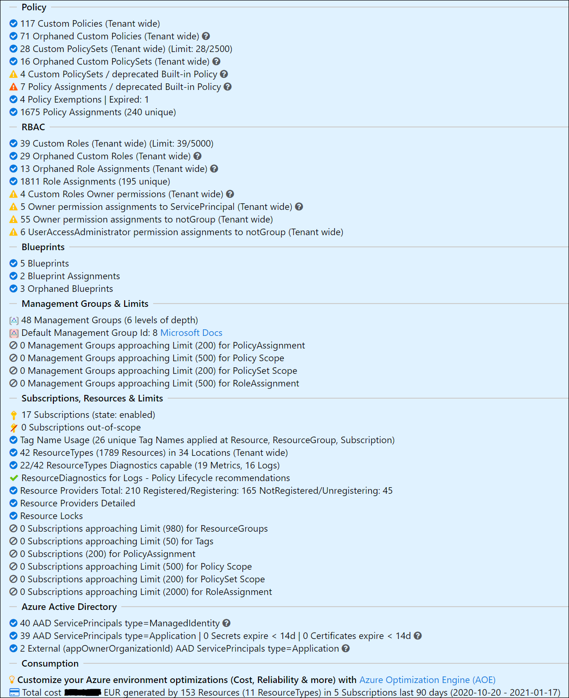

# AzGovViz - Azure Governance Visualizer

Do you want to get granular insights on your technical Azure Governance implementation? - document it in CSV, HTML and MD (Markdown)?  
AzGovViz is a PowerShell based script that iterates your Azure Tenant´s Management Group hierarchy down to Subscription level. It captures most relevant Azure governance capabilities such as Azure Policy, RBAC and Blueprints and a lot more. From the collected data AzGovViz provides visibility on your __HierarchyMap__, creates a __TenantSummary__ and builds granular __ScopeInsights__ on Management Groups and Subscriptions. The technical requirements as well as the required permissions are minimal.

You can run the script either for your Tenant Root Group or any other Management Group that you have read access on.

<table>
<td>

"_Governance can be a complex thing_.."

Challenges:

 * Holistic overview on governance implementation  
 * Connecting the dots

AzGovViz is intended to help you to get a holistic overview on your technical Azure Governance implementation by connecting the dots.

</td>
<td>

</td>
</table>

## AzGovViz @ Microsoft Cloud Adoption Framework

<table>
<td>

</td>
<td>

Listed as tool for the Govern discipline in the Microsoft Cloud Adoption Framework!  
https://docs.microsoft.com/en-us/azure/cloud-adoption-framework/reference/tools-templates#govern

Included in the Microsoft Cloud Adoption Framework´s [Strategy-Plan-Ready-Gov](https://azuredevopsdemogenerator.azurewebsites.net/?name=strategyplan) Azure DevOps Demo Generator template. 

</td>
</table>

## AzGovViz version history

### AzGovViz version 4

Updates 2021-Jan-08
* Feature: __Cost Management / Consumption Reporting__ - Changed AzureConsumptionPeriod default to 1 day  

* Bugfixes

Updates 2021-Jan-06 - Happy New Year
* Feature: Resolve __Azure Active Directory Group memberships__ for Role assignment with identity type 'Group' leveraging Microsoft Graph. With this capability AzGovViz can ultimately provide holistic insights on permissions granted for Management Groups and Subscriptions (honors parameter `-DoNotShowRoleAssignmentsUserData`). Use parameter `-NoAADGroupsResolveMembers` to disable the feature  

* Feature: New __TenantSummary__ section '__Azure Active Directory__' -> Check all Azure Active Directory Service Principals (type=Application that have a Role assignment) for Secret/Certificate expiry. Mark all Service Principals (type=ManagedIdentity) that are related to a Policy assignments. Use parameter `-NoServicePrincipalResolve` to disable this feature
* Feature: __Cost Management / Consumption Reporting__ for Subscriptions including aggregation at Management Group level. Use parameter `-NoAzureConsumption` to disable this feature.  
__Note__: Per default the consumption query will request consumption data for the last full 1 day (if you run it today, will capture the cost for yesterday), use the parameter `-AzureConsumptionPeriod` to define a favored time period  e.g. `-AzureConsumptionPeriod 7` (for 7 days) 
* Removed parameter `-Experimental`. 'Resource Diagnostics Policy Lifecycle' enabled by default. Use `-NoResourceDiagnosticsPolicyLifecycle` to disable the feature.
* Renamed parameter `-DisablePolicyComplianceStates` to `-NoPolicyComplianceStates` for better consistency
* Optimize 'Get Resource Types capability for Resource Diagnostics' query - thanks Brooks Vaughn
* Update Pipeline to honor [master/main change](https://devblogs.microsoft.com/devops/azure-repos-default-branch-name)
* Add info to HTML file on parameters used
* Performance optimization

Updates 2020-Dec-17
* Now supporting > 5000 entities (Subscriptions/Management Groups) :) thanks Brooks Vaughn

Updates 2020-Dec-15
* Pipeline `azurePowerShellVersion: latestVersion` / ensures compatibility with latest [Az.ResourceGraph 0.8.0 Release](https://github.com/Azure/azure-powershell/releases/tag/Az.ResourceGraph-v0.8.0)
* Error handling optimization / API
* Fix 'deprecated Policy assignments'
* Fix 'orphaned Custom Role definitions'

Updates 2020-Nov-30
* New parameter ~~`-DisablePolicyComplianceStates`~~ `-NoPolicyComplianceStates` (see [__Parameters__](#powerShell))
* Error handling optimization / API

Updates 2020-Nov-25
* Highlight default Management Group
* Add AzAPICall debugging parameter `-DebugAzAPICall`
* Fix for using parameter `-HierarchyMapOnly`

Updates 2020-Nov-19
* New parameter `-Experimental` (see [__Parameters__](#powerShell))
* Performance optimization
* Error handling optimization / API
* Azure DevOps pipeline worker changed from 'ubuntu-latest' to 'ubuntu-18.04' (see [Azure Pipelines - Sprint 177 Update](https://docs.microsoft.com/en-us/azure/devops/release-notes/2020/pipelines/sprint-177-update#ubuntu-latest-pipelines-will-soon-use-ubuntu-2004), [Ubuntu-latest workflows will use Ubuntu-20.04 #1816](https://github.com/actions/virtual-environments/issues/1816))

Updates 2020-Nov-08
* Re-model Bearer token handling (Az PowerShell Module Az.Accounts > 1.9.5 no longer provides access to the tokenCache [GitHub issue](https://github.com/Azure/azure-powershell/issues/13337))
* Adding Scope information for Custom Policy definitions and Custom PolicySet definitions sections in __TenantSummary__
* Cosmetics and User Experience enhancement
* New [__demo__](#demo)

Updates 2020-Nov-01
* Error handling optimization
* Enhanced read-permission validation
* Toggle capabilities in __TenantSummary__ (avoiding information overload)

Updates 2020-Oct-12
* Adding option to download HTML tables to csv  

* preloading of <a href="https://www.tablefilter.com/" target="_blank">TableFilter</a> removed for __ScopeInsights__ (on poor hardware loading the HTML file took quite long)
* Added column un-select option for some HTML tables
* Performance optimization

Release v4
* Resource information for Management Groups (Resources in all child Subscriptions) in the __ScopeInsights__ section
* Excluded Subscriptions information (whitelisted, disabled, AAD_ QuotaId)
* Bugfixes, Bugfixes, Bugfixes
* Cosmetics and User Experience enhancement
* Performance optimization
* API error handling / retry optimization
* New Parameters `-NoASCSecureScore`, `-NoResourceProvidersDetailed` (see [__Parameters__](#powerShell))

### AzGovViz version 3

* HTML filterable tables
* Resource Types Diagnostics capability check
* ResourceDiagnostics Policy Lifecycle recommendations (experimental)
* Resource Diagnostics Policy Findings
* Resource Provider details
* Policy assignments filter excluded scopes
* Use of deprecated uilt-in Policy definitions
* Subscription QuotaId Whitelist

### AzGovViz version 2

* Optimized user experience for the HTML output
* __TenantSummary__ / selected Management Group scope
* Reflect Tenant, ManagementGroup and Subscription Limits for Azure Governance capabilities
* Some security related best practice highlighting
* More details: Management Groups, Subscriptions, Policy definitions, PolicySet definitions (Initiatives), orphaned Policy definitions, RBAC and Policy related RBAC (DINE MI), orphaned Role definitions, orphaned Role assignments, Blueprints, Subscription State, Subscription QuotaId, Subscription Tags, Azure Scurity Center Secure Score, ResourceGroups count, Resource types and count by region, Limits, Security findings
* Resources / leveraging Azure Resource Graph
* Parameter based output (hierarchy only, 'srubbed' user information and more..)
* HTML version check

## AzGovViz in Action

### Demo

<a href="https://www.azadvertizer.net/azgovvizv4/demo/AzGovViz_EnterpriseScale_Demo_FOM.html" target="_blank">AzGovViz Demo</a> EnterpriseScale implementation (v4 2020-11-08)

### Screenshots

HTML file

__HierarchyMap__  
  
__TenantSummary__
  
__ScopeInsights__
  
*_IDs from screenshot are randomized_

markdown in Azure DevOps Wiki as Code

 
*_IDs from screenshot are randomized_

### Outputs

* CSV file
* HTML file
  * the HTML file uses Java Script and CSS files which are hosted on various CDNs (Content Delivery Network). For details review the BuildHTML region in the AzGovViz.ps1 script file.
  * Browsers tested: Edge, new Edge and Chrome
* MD (Markdown) file
  * for use with Azure DevOps Wiki leveraging the [Mermaid](https://docs.microsoft.com/en-us/azure/devops/release-notes/2019/sprint-158-update#mermaid-diagram-support-in-wiki) plugin

> Note: there is some fixing ongoing at the mermaid project to optimize the graphical experience:  
 <https://github.com/mermaid-js/mermaid/issues/1177>

## AzGovViz slideset

Short presentation on AzGovViz [Download](slides/AzGovViz_intro.pdf)

## AzGovViz technical documentation

### Required permissions in Azure

* RBAC permissions: __Reader__ role on Management Group level
* API permissions: If you run the script in the context of a Service Principal or in Azure Automation or on a Azure DevOps hosted agent (on top of the RBAC Role: _Reader_ on Management Group level) you will need to grant API permissions in Azure Active Directory (get-AzRoleAssignment cmdlet requirements). The Automation Account or Service Connection __App registration (Application)__ must be granted with: __Azure Active Directory API | Application | Directory | Read.All__ (admin consent required)

### Usage

#### PowerShell

* Requires PowerShell Az Modules
  * Az.Accounts
  * Az.Resources
  * Az.ResourceGraph
* Usage
  * `.\AzGovViz.ps1 -ManagementGroupId <your-Management-Group-Id>`
* Parameters
  * `-ManagementGroupId` Tenant Id or any child Management Group Id
  * `-CsvDelimiter` the world is split into two kind of delimiters - comma and semicolon - choose yours
  * `-OutputPath`
  * `-AzureDevOpsWikiAsCode`
  * `-DoNotShowRoleAssignmentsUserData` scrub personally identifiable information (PII)
  * `-LimitCriticalPercentage` limit warning level, default is 80%
  * ~~`-HierarchyTreeOnly`~~ `-HierarchyMapOnly` output only the __HierarchyMap__ for Management Groups including linked Subscriptions
  * `-SubscriptionQuotaIdWhitelist` process only subscriptions with defined QuotaId(s)
  * `-NoResourceProvidersDetailed` disables output for ResourceProvider states for all Subscriptions in the __TenantSummary__ section, in large Tenants this can become time consuming
  * `-NoASCSecureScore` disables ASC Secure Score request for Subscriptions. The used API is in preview you may want to disable this
  * ~~`-DisablePolicyComplianceStates`~~ `-NoPolicyComplianceStates` will not query policy compliance states. You may want to use this parameter to accellerate script execution or when receiving error 'ResponseTooLarge'. 
  * `-NoResourceDiagnosticsPolicyLifecycle` disables Resource Diagnostics Policy Lifecycle recommendations
  * `-NoAADGroupsResolveMembers` disables resolving Azure Active Directory Group memberships
  * `-NoServicePrincipalResolve` disables resolving ServicePrincipals
  * `-ServicePrincipalExpiryWarningDays` define warning period for Service Principal secret and certificate expiry; default is 14 days
  * `-NoAzureConsumption` Azure Consumption data should not be collected/reported
  * `-AzureConsumptionPeriod` define for which time period Azure Consumption data should be gathered; default is 1 day
  * `-NoAzureConsumptionReportExportToCSV` Azure Consumption data should not be exported (CSV)
  * ~~`-UseAzureRM`~~ support for AzureRm modules has been deprecated
  * ~~`-Experimental`~~ executes experimental features. Latest experimental feature: 'ResourceDiagnostics Policy Lifecycle recommendations' - e.g. it checks on all existing Custom Policy definitions that deploy resource diagnostics settings if all available log categories are defined in the policy (may they be enabled or disabled)
* Passed tests: Powershell Core on Windows
* Passed tests: Powershell 5.1.18362.752 on Windows
* Passed tests: Powershell Core on Linux Ubuntu 18.04 LTS

#### Azure DevOps Pipeline

The provided example Pipeline is configured to run based on a [schedule](https://docs.microsoft.com/en-us/azure/devops/pipelines/process/scheduled-triggers) (every 12 hours). It will push the AzGovViz markdown output file to the 'wiki' folder in the 'Azure-MG-Sub-Governance-Reporting' Repository which will feed your Wiki.

1. In Azure DevOps make sure to [enable](https://docs.microsoft.com/en-us/azure/devops/project/navigation/preview-features?view=azure-devops&tabs=new-account-enabled) the Multistage Pipelines feature <https://docs.microsoft.com/en-us/azure/devops/pipelines/get-started/multi-stage-pipelines-experience?view=azure-devops>
2. Clone the AzGovViz Repo
3. Create Pipeline, configure your pipeline selecting __Existing Azure Pipelines YAML file__, select the AzGovViz YAML from the AzGovViz (Azure-MG-Sub-Governance-Reporting) Repo
4. Grant Repository permissions: In order to allow the pipeline to push files back to our 'wiki' folder in the 'Azure-MG-Sub-Governance-Reporting' Repository the __Build Service__ Account ('%ProjectName% Build Service (%OrgName%)') must be granted with __Contribute__ permission  

5. Run the Pipeline
6. Create Wiki by choosing [Publish Code as Wiki](https://docs.microsoft.com/en-us/azure/devops/project/wiki/publish-repo-to-wiki?view=azure-devops&tabs=browser), define the folder 'wiki' from the 'Azure-MG-Sub-Governance-Reporting' Repository as source

> Make sure your Service Connection has the required permissions (see [__Required permissions in Azure__](#required-permissions-in-azure)).

## AzGovViz sidenotes

### Security

AzGovViz creates very detailed information about your Azure Governance setup. In your organization's best interest the __outputs should be protected from not authorized access!__

### Facts

Disabled Subscriptions and Subscriptions where Quota Id starts with with "AAD_" are being skipped (check parameter `-SubscriptionQuotaIdWhitelist`), all others are queried. More info on Quota Id / Offer numbers: <a href="https://docs.microsoft.com/en-us/azure/cost-management-billing/costs/understand-cost-mgt-data#supported-microsoft-azure-offers" target="_blank">Supported Microsoft Azure offers</a> 
.  

ARM Limits are not acquired programmatically, they are hardcoded. The links used to check related Limits are commented in the param section of the script.

### Contributions

Please feel free to contribute. Thanks to so many supporters - testing, giving feedback, making suggestions, presenting use-case, posting/blogging articles, refactoring code - THANK YOU!

Thanks Stefan Stranger (Microsoft) for providing me with his AzGovViz outputs executed on his implementation of EnterpriseScale. Make sure you read Stefan´s Blog Article: <a href="https://stefanstranger.github.io/2020/08/28/EnterpriseScalePolicyDrivenGovernance/" target="_blank">Enterprise-Scale - Policy Driven Governance</a> 

Thanks Frank Oltmanns-Mack (Microsoft) for providing me with his AzGovViz outputs executed on his implementation of EnterpriseScale (see latest [__demo__](#demo)).

Special thanks to Tim Wanierke, Brooks Vaughn and Friedrich Weinmann (Microsoft).

Kudos to the <a href="https://www.tablefilter.com/" target="_blank">TableFilter</a> Project Team!

## AzAdvertizer

Also check <https://www.azadvertizer.net> - AzAdvertizer helps you to keep up with the pace by providing overview and insights on new releases and changes/updates for Azure Governance capabilities such as Azure Policy's Policy definitions, initiatives (Set definitions), aliases and Azure RBAC's Role definitions and resource provider operations.

## Final Note

Please note that while being developed by a Microsoft employee, AzGovViz is not a Microsoft service or product. AzGovViz is a personal/community driven project, there are none implicit or explicit obligations related to this project, it is provided 'as is' with no warranties and confer no rights.