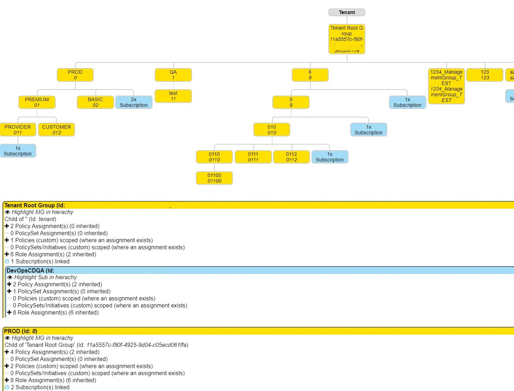

# Azure-MG-Sub-Governance-Reporting

this script iterates MG hierachy down to Subscription level capturing RBAC, Policies and Policy Initiatives

requirements:

* RBAC 'Management Group Reader' Role
* RBAC 'Reader' Role
* PowerShell Az Modules

outputs html hierachy view and detailed csv file:  

* Management Group
  * MGHierachyLevel
  * MGName
  * MGId
* Subscription
  * SubscriptionName
  * SubscriptionId
* Policy
  * PolicyDisplayName
  * PolicyId
  * PolicyType
  * PolicyScope
  * PolicyVariant (Policy/PolicySet)
* Role
  * RoleDefinitionName
  * RoleDefinitionId
  * RoleIsCustom
* RoleAssignment
  * RoleAssignmentDisplayName
  * RoleAssignmentSignInName
  * RoleAssignmentObjectId
  * RoleAssignmentObjectType
  * RoleAssignmentId
  * RoleAssignmentScope
  * RoleAssignableScopes

Also check <https://www.azadvertizer.net> to keep up with the pace on Azure Governance capabilities such as Azure Policy, Policy Initiatives, Policy Aliases and RBAC/Roles
