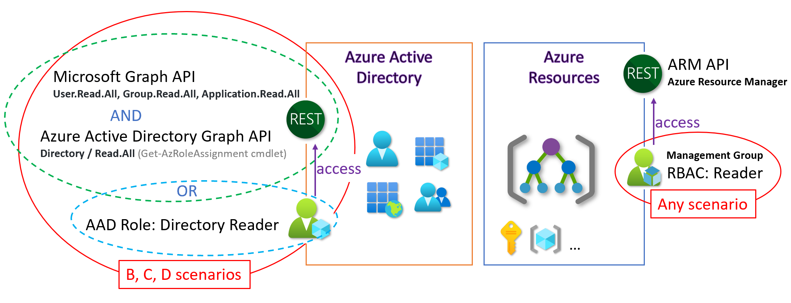

# Azure Governance Visualizer aka AzGovViz

_Do you want to get granular insights on your technical Azure Governance implementation and document it in CSV, HTML, Markdown, and JSON?_

Azure Governance Visualizer is a PowerShell based script that iterates through your Azure Tenant's Management Group hierarchy, starting from the root Management Group down to the Subscription, Resource Group and Resource level. It collects data from various Azure APIs including Azure ARM, Microsoft Graph and Storage.

From the collected data it generates enriched insights for capabilities such as Azure Policy, RBAC, and a lot more.

Within an HTML output it provides visibility on your **HierarchyMap**, creates a **TenantSummary**, creates **DefinitionInsights** and builds granular **ScopeInsights** on Azure Management Groups and Subscriptions.

Further, CSV exports with enriched information per capability will be generated and detailed JSON files are exported which document your entire Azure tenant setup for Management Groups, Subscriptions, Azure RBAC definitions and assignments, Azure policy definitions and assignments. These exports come in handy for change tracking scenarios as well as redeployment of configuration (e.g. tenant migration scenario) and can even serve as a backup.

The technical requirements as well as the required permissions are minimal.

You can run the script either for your tenant root management group or any other management group.

## Mission

"_Governance can be a complex thing_.."

Challenges:

- Holistic overview on governance implementation
- Connecting the dots

Azure Governance Visualizer is intended to help you to get a holistic overview on your technical Azure Governance implementation by **connecting the dots**.


## Table of contents

- [Azure Governance Visualizer aka AzGovViz](#azure-governance-visualizer-aka-azgovviz)
  - [Mission](#mission)
  - [Table of contents](#table-of-contents)
  - [Azure Governance Visualizer @ Microsoft CAF](#azure-governance-visualizer--microsoft-caf)
    - [Microsoft Cloud Adoption Framework (CAF)](#microsoft-cloud-adoption-framework-caf)
    - [Azure Governance Visualizer accelerator](#azure-governance-visualizer-accelerator)
  - [:rocket: Azure Governance Visualizer deployment guide](#rocket-azure-governance-visualizer-deployment-guide)
  - [Release history](#release-history)
  - [Demo](#demo)
  - [Media](#media)
    - [Presentations](#presentations)
  - [Features](#features)
  - [Screenshots](#screenshots)
  - [Outputs](#outputs)
  - [Trust](#trust)
  - [Technical documentation](#technical-documentation)
    - [Permissions overview](#permissions-overview)
    - [Required permissions in Azure](#required-permissions-in-azure)
    - [Required permissions in Microsoft Entra ID](#required-permissions-in-microsoft-entra-id)
    - [PowerShell](#powershell)
    - [Parameters](#parameters)
    - [API reference](#api-reference)
  - [Integrate with AzOps](#integrate-with-azops)
  - [Integrate PSRule for Azure](#integrate-psrule-for-azure)
  - [Stats](#stats)
    - [How / What?](#how--what)
  - [Security](#security)
  - [Known issues](#known-issues)
  - [Facts](#facts)
  - [Contribution](#contribution)
  - [AzAdvertizer](#azadvertizer)
  - [AzADServicePrincipalInsights](#azadserviceprincipalinsights)
  - [Closing Note](#closing-note)

## Azure Governance Visualizer @ Microsoft CAF

### Microsoft Cloud Adoption Framework (CAF)

- Listed as [tool](https://learn.microsoft.com/azure/cloud-adoption-framework/resources/tools-templates#govern) for the Govern discipline in the Microsoft Cloud Adoption Framework.
- Included in the Cloud Adoption Framework's [Strategy-Plan-Ready-Governance](https://azuredevopsdemogenerator.azurewebsites.net/?name=strategyplan) Azure DevOps Demo Generator template.

## :rocket: Azure Governance Visualizer deployment guide

The instructions to deploy the Azure Governance Visualizer is found in the **[Azure Governance Visualizer (AzGovViz) deployment guide](setup.md)**. Follow those instructions to run AzGovViz from your terminal (console), GitHub Codepaces, Azure DevOps, or GitHub.

As an alternative, you can use the [Azure Governance Visualizer accelerator](https://github.com/Azure/Azure-Governance-Visualizer-Accelerator) to deploy the Azure Governance Visualizer per code.

### Azure Governance Visualizer accelerator

The [Azure Governance Visualizer accelerator](https://github.com/Azure/Azure-Governance-Visualizer-Accelerator) provides an easy and fast deployment process that automates the creation and publishing of AzGovViz to an Azure Web Application and provides automation to configuring the pre-requisites for AzGovViz.

## Release history

**Changes** (2024-July-15 / 6.4.11 Minor)

- ALZ policy refresh H2 FY24 (initiatives.json)
- [DevSkim](https://github.com/microsoft/DevSkim-Action), [PSScriptAnalyzer](https://github.com/microsoft/psscriptanalyzer-action) and [OpenSSF Scorecard](https://github.com/ossf/scorecard?tab=readme-ov-file#scorecard-github-action) integration
- fixes and optimization based on DevSkim, PSScriptAnalyzer and OpenSSF Scorecard findings
- api version mapping in param block for cloud environment api version availability drift
- update GitHub workflows to use azure/login@v2 (previous: azure/login@v1):
  - [AzGovViz_OIDC.yml](/.github/workflows/AzGovViz_OIDC.yml)
  - [AzGovViz.yml](/.github/workflows/AzGovViz.yml)
- update getConsumption (experimental for now): instead of full Management Group scope costmanagement data retrieval, batch by Subscription quotaId in batches of 100. Failing batches and batches of Subscriptions of quotaId `CSP_2015-05-01` (see param block variable `SubscriptionQuotaIdsThatDoNotSupportCostManagementManagementGroupScopeQuery`) will fallback to get costmanagement data per Subscription. In order to use this you must update the AzGovVizParallel.ps1 file to use the function `getConsumptionv2` instead of `getConsumption`
- html; update jquery; source tablefilter js
- update `.devcontainer/devcontainer.json`

[Full release history](history.md)

## Demo

[](https://www.azadvertizer.net/azgovvizv4/demo/AzGovViz_demo.html)

[Demo (v6_major_20220927_1)](https://www.azadvertizer.net/azgovvizv4/demo/AzGovViz_demo.html)

More [demo output](https://github.com/JulianHayward/AzGovViz)

## Media

- Microsoft Tech Talks - Bevan Sinclair (Cloud Solution Architect Microsoft) [Automated Governance Reporting in Azure (MTT0AEDT)](https://mtt.eventbuilder.com/event/66431) (register to view)
- Microsoft Dev Radio (YouTube) [Get visibility into your environment with Azure Governance Visualizer](https://www.youtube.com/watch?v=hZXvF5oypLE)
- Jack Tracey (Cloud Solution Architect Microsoft) [Azure Governance Visualizer With Azure DevOps](https://jacktracey.co.uk/azgovviz-with-azure-devops/)
- SCHUTTEN.CLOUD [Automate Pertinent Governance Insight with Azure Governance Visualizer](https://schutten.cloud/post/azure-governance-visualizer/)

### Presentations

Short presentation on Azure Governance Visualizer: [download](slides/AzGovViz_intro.pdf)

## Features

- **Hierarchy of Azure management groups**
  - Builds a visual hierarchy of your management group setup including counts on linked Azure subscriptions, Azure Policy assignments, scoped policy/set definitions and role assignments per management group
- **Azure Policy**
  - Custom policy definitions
    - Scope information
    - Policy effect
    - If policy effect is DeployIfNotExists (DINE) will show the specified Azure RBAC role
    - List of assignments
    - Usage in custom PolicySet definitions
    - System metadata 'createdOn, createdBy, updatedOn, updatedBy' ('createdBy', 'updatedBy' identity is fully resolved)
  - Orphaned custom policy definitions
    - List of custom policy definitions that matches the following criteria:
      - Policy definition is not used in any custom PolicySet definition
      - No policy assignment exists for the policy definition
  - Custom PolicySet definitions
    - Scope information
    - List unique assignments
    - List of policy definitions used
  - Orphaned custom PolicySet definitions
    - Criteria: no policy assignment exists for the PolicySet definition
  - Custom PolicySet definitions using deprecated built-in policy definitions
  - Policy assignments of deprecated built-in policy definition
  - Policy exemptions
    - Lists all exemptions (scopes: management groups, subscriptions, resource groups, and resources)
    - Enrich information on exemption scope
    - Summary on expired exemptions
  - Policy assignments orphaned
    - Policy assignments's policy definition does not exist / likely management group scoped Policy definition - management group deleted
  - Policy assignments throughout the entirety of scopes (management groups, subscriptions, and resource groups)
    - Core information on policy assignments
      - NonCompliance message on policy assignment for a PolicySet will only show the default non-compliance message
    - Advanced/enriched information on policy assignments
      - Policy assignment scope (at scope/inheritance)
      - Indicates if scope is excluded from policy assignment
      - Indicates if exemption applies for scope
      - Policy/resource compliance (Policy: NonCompliant, Compliant; Resource: NonCompliant, Compliant, Conflicting)
      - Related Azure RBAC role assignments (if policy effect is DeployIfNotExists (DINE) or Modify)
      - Resolved managed identity (if policy effect is DeployIfNotExists (DINE) or Modify)
      - System metadata 'createdOn, createdBy, updatedOn, updatedBy' ('createdBy', 'updatedBy' identity is fully resolved)
      - Parameters used
  - Azure landing zone (ALZ) policy version checker for policy and set definitions. Azure Governance Visualizer will clone the Azure landing zone GitHub repository and collect the Azure landing zone policy and set definitions history. The ALZ data will be compared with the data from your tenant so that you can get lifecycle management recommendations for ALZ policy and set definitions that already exist in your tenant plus a list of ALZ policy and set definitions that do not exist in your tenant. The ALZ policy version checker results will be displayed in the **TenantSummary** and a CSV export `*_ALZPolicyVersionChecker.csv` will be provided.
  - Policy Remediation - list all remediatable policies including relevant information such as assignment and definition data
- **Azure role-based access control (RBAC)**
  - Custom role definitions
    - List assignable scopes
    - System metadata 'createdOn, createdBy, updatedOn, updatedBy' ('createdBy', 'updatedBy' identity is fully resolved)
  - Orphaned custom role definitions
    - List of custom role definitions that matches the following criteria:
      - Role definition is not used in any role assignment
      - Role is not used in a policy definition's rule (roleDefinitionIds)
  - Orphaned role assignments
    - List of role assignments that matches the following criteria:
      - Role definition was deleted although and assignment existed
      - Role assignment's target identity (User, Group, ServicePrincipal) was deleted
  - Role assignments throughout the entirety of scopes (management groups, subscriptions, resource groups, and resources)
    - Core information on role assignments
    - Advanced information on role assignments
      - Role assignment scope (at scope / inheritance)
      - For role assignments on groups the Microsoft Entra group members are fully resolved. With this capability, Azure Governance Visualizer can ultimately provide holistic insights on permissions granted.
      - For role assignments on groups the Microsoft Entra group members count (transitive) will be reported
      - For identity-type == 'ServicePrincipal' the type (Application (internal/external) / ManagedIdentity (System assigned/User assigned)) will be revealed
      - For identity-type == 'User' the userType (Member/Guest) will be revealed
      - Related policy assignments (Policy assignment that use the DeployIfNotExists (DINE) or Modify effect)
      - System metadata 'createdOn, createdBy' ('createdBy' identity is fully resolved)
      - Determine if the role assignment is 'standing' or PIM (Privileged Identity Management) managed
      - Determine if the role assignment's role definition is capable to write role assignments
  - PIM (Privileged Identity Management) eligibility for role assignments
    - Get a full report of all PIM eligible role assignments for management groups and subscriptions, including resolved user members of Microsoft Entra ID groups that have assigned eligibility
    - &#x1F4A1; Note: this feature requires you to execute as service principal with `Application` API permission `PrivilegedAccess.Read.AzureResources`
  - Role assignments ClassicAdministrators
  - Security & best practice analysis
    - Existence of custom role definition that reflect 'Owner' permissions
    - Report all role definitions that are capable to write role assignments, list all role assignments for those role definitions
    - Role assignments for 'Owner' permissions on identity-type == 'ServicePrincipal'
    - Role assignments for 'Owner' permissions on identity-type != 'Group'
    - Role assignments for 'User Access Administrator' permissions on identity-type != 'Group'
    - High privilege role assignments for 'Guest Users' (Owner & User Access Administrator)
- **Blueprints**
  - Blueprint scopes and assignments
  - Orphaned Blueprints
- **Management groups**
  - Management group count, level/depth, management group children, and sub children
  - Hierarchy Settings | Default management group ID
  - Hierarchy Settings | Require authorization for management group creation
- **Subscriptions, resources & Microsoft Defender**
  - Subscription insights
    - State
    - QuotaId
    - Role assignment limit
    - Tags
    - Owner & User Access Administrator role assignment count (at scope) direct and indirect plus PIM eligibility count
    - Microsoft Defender for Cloud secure score
    - Microsoft Defender for Cloud email notifications configuration
    - Cost
    - Management group path
  - Tag name usage
    - Insights on usage of tag names on subscriptions, resource groups, and resources
  - Resources
    - Resource types
      - Resource type count per location
      - Resource provider
        - Resource provider state aggregation throughout all subscriptions
        - Explicit resource provider state per subscription
      - Resource locks
        - Aggregated insights for lock and respective lock-type usage on subscriptions, resource groups, and resources
        - CSV output detailed / each scope that has a lock applied (at scope)
    - Resource fluctuation - added/removed resources since previous Azure Governance Visualizer execution
      - Aggregated insights on resource fluctuation add/remove (HTML)
      - Detailed insights on resource fluctuation add/remove (CSV)
    - Cost optimization & cleanup (ARG)
      - If you run Azure Governance Visualizer with parameter `-DoAzureConsumption` then the orphaned/unused resources output will show you potential cost savings for orphaned/unused resources with intent 'cost savings'
      - The cost optimization & cleanup feature is based on [Azure Orphan Resources - GitHub](https://github.com/dolevshor/azure-orphan-resources) ARG queries and workbooks by Dolev Shor
      - The virtual machines that are stopped but not deallocated are still generating compute costs. You should check if there are virtual machines running within your environment that are only stopped. The output will show these virtual machines with intent 'cost savings - stopped but not deallocated VM'.
    - Cloud Adoption Framework (CAF) [Abbreviation examples for Azure resources](https://learn.microsoft.com/azure/cloud-adoption-framework/ready/azure-best-practices/resource-abbreviations) alignment checks
  - Microsoft Defender for Cloud
    - Summary of Microsoft Defender for Cloud coverage by plan (count of subscription per plan/tier)
    - Summary of Microsoft Defender for Cloud plans coverage by subscription (plan/tier)
    - Highlight the usage of deprecated Defender plans (e.g. Container Registry & Kubernetes)
  - User-assigned managed identities assigned to resources / vice versa
    - Summary of all user-assigned managed identities assigned to resources
    - Summary of resources that have a user-assigned managed identity assigned
  - [Integrate PSRule for Azure](#integrate-psrule-for-azure)
    - **Pausing 'PSRule for Azure' integration**. Azure Governance Visualizer uses the Invoke-PSRule cmdlet, but there are certain [resource types](https://github.com/Azure/PSRule.Rules.Azure/blob/ab0910359c1b9826d8134041d5ca997f6195fc58/src/PSRule.Rules.Azure/PSRule.Rules.Azure.psm1#L1582) where also child resources need to be queried to achieve full rule evaluation.
    - Well-Architected Framework aligned best practice analysis for resources, including guidance for remediation
  - Azure Storage account access analysis
    - Provides insights on Storage accounts with focus on anonymous access (containers/blobs and 'Static website' feature)
- **Network**
  - Virtual networks
  - Subnets
  - Virtual network peerings
  - Private endpoints
- **Diagnostics**
  - Management groups diagnostic settings report
    - Management group, diagnostic setting name, target type (Log Analytics, Storage account, Event Hub), target resource ID, log category status
  - Subscriptions diagnostic settings report
    - Subscription, diagnostic setting name, target type (Log Analytics, Storage account, Event Hub), target resource ID, log category status
  - Resources diagnostic capability report (1st party resource types only)
    - Resource type capability for resource diagnostics including:
      - Resource type count and information if capable for logs including list of available og categories
      - Resource type count and information if capable for metrics
  - Lifecycle recommendations for existing Azure Policy definitions that configure resource diagnostics of type=Log
    - Check if policy definitions hold the latest set of applicable log categories
    - Recommendation to create policy definition for resource type if supported
    - Lists all policy definitions that deploy resource diagnostics of type=log, lists policy assignments and PolicySet assignments if the policy definition is used in a PolicySet definition
- **Limits**
  - Tenant approaching ARM limits:
    - Custom role definitions
    - PolicySet definitions
  - Management groups approaching ARM limits:
    - Policy assignment limit
    - Policy / PolicySet definition scope limit
    - Role assignment limit
  - Subscriptions approaching ARM limits:
    - Resource group limit
    - Subscription tags limit
    - Policy assignment limit
    - Policy / PolicySet definition scope limit
    - Role assignment limit
- **Microsoft Entra ID**
  - Insights on those service principals where a role assignment exists (scopes: management group, subscription, resource group, and resource):
    - Type=ManagedIdentity
      - Core information on the service principal such as related IDs, use case information and role assignments
      - For user-managed identities the count of assignment to resources is reported
      - Orphaned managed identity - policy assignment related managed identities / the related policy assignment does not exist
      - User-assigned managed identity - count of resources that it is assigned to
    - Type=Application
      - Secrets and Certificates expiry information & warning
      - Report on external service principals
- **Consumption**
  - Aggregated consumption insights throughout the entirety of scopes (management groups, subscriptions)
- **Change tracking**
  - Policy
    - Created/Updated policy and PolicySet definitions (system metadata 'createdOn, createdBy, updatedOn, updatedBy')
    - Created/Updated policy assignments (system metadata 'createdOn, createdBy, updatedOn, updatedBy')
  - RBAC
    - Created/Updated role definitions (system metadata 'createdOn, createdBy, updatedOn, updatedBy')
    - Created role assignments (system metadata 'createdOn, createdBy)
  - Resources
    - Aggregated insights on created/changed resources

## Screenshots

HTML file

**HierarchyMap**


**TenantSummary**


**DefinitionInsights**


**ScopeInsights**


\*_IDs from screenshot are randomized_

markdown in Azure DevOps Wiki as Code

 \*_IDs from screenshot are randomized_

> Note: there is some fixing ongoing at the mermaid project to optimize the graphical experience:
> <https://github.com/mermaid-js/mermaid/issues/1177>

## Outputs

- CSV file
- HTML file
  - the HTML file uses JavaScript and CSS files which are hosted on various CDNs (Content Delivery Network). For details review the BuildHTML region in the PowerShell script file.
  - Browsers tested: Edge and Chrome
- MD (Markdown) file
  - for use with Azure DevOps Wiki using the [Mermaid](https://learn.microsoft.com/azure/devops/release-notes/2019/sprint-158-update#mermaid-diagram-support-in-wiki) plugin
- JSON folder ([demo-output](https://github.com/JulianHayward/AzGovViz)) containing

  - all policy and role assignments (Scopes: tenant, management groups, and subscriptions)
  - all built-in and custom policy & policy set definitions (Scopes: management groups and subscriptions)
  - all built-in and custom role definitions
  - JSON file of management group hierarchy including all custom policy, policy set, and RBAC definitions, policy and role assignments and some more relevant information
  - Tenant tree including all policy and role assignments and all custom policy & policy set and role definitions

  

## Trust

_How can we trust a 20k lines PowerShell script?_ Besides assuring that Azure Governance Visualizer will not harm at any intent, you may want to secure yourself. Let's use Azure built-in capabilities such as VM Insights to monitor the Azure Governance Visualizer activity.

Setup a Virtual Machine in Azure, deploy the dependency agent extension and [execute](setup.md#set-up-and-run-azure-governance-visualizer-from-the-console) Azure Governance Visualizer.

In the Azure Portal navigate to the Virtual Machine, Click on **Insights** in the **Monitoring** section and click on Map. All connections that have been established will be shown. Now let's focus on the process **pwsh** and review the established connections.


Query for Log Analytics:

```kusto
VMConnection
| where AgentId =~ '<GUID>'
| where ProcessName =~ 'pwsh'
| summarize by DestinationIp, DestinationPort, RemoteIp, Protocol, Direction, RemoteDnsQuestions, BytesSent, BytesReceived
```

## Technical documentation

### Permissions overview



### Required permissions in Azure

These permissions are **mandatory** in each and every scenario!

| Scenario | Permissions                                        |
| :------- | :------------------------------------------------- |
| ALL      | '**Reader**' role assignment on _management group_ |

### Required permissions in Microsoft Entra ID

<table>
  <tbody>
    <tr>
      <th>Scenario</th>
      <th>Permissions</th>
    </tr>
    <tr>
      <td><b>A</b><br>Console | Member user account</td>
      <td>No Microsoft Entra ID permissions required
      </td>
    </tr>
    <tr>
      <td><b>B</b><br>Console | Guest user account</td>
      <td>If the tenant is hardened (Microsoft Entra ID External Identities / Guest user access = most restrictive) then Guest User must be assigned the Microsoft Entra role 'Directory readers'<br>
      &#x1F4A1; <a href="https://learn.microsoft.comentra/fundamentals/users-default-permissions#compare-member-and-guest-default-permissions" target="_blank">Compare member and guest default permissions</a><br>
      &#x1F4A1; <a href="https://learn.microsoft.com/entra/identity/users/users-restrict-guest-permissions" target="_blank">Restrict guest access permissions in Microsoft Entra ID</a>
      </td>
    </tr>
    <tr>
      <td><b>C</b><br>Console | Service principal | Managed identity</td>
      <td>
        <table>
          <tbody>
            <tr>
              <th>Capability</th>
              <th>Microsoft Graph API permissions</th>
            </tr>
            <tr>
              <td>Get Microsoft Entra ID<br>Users</td>
              <td>Service principal's <b>App registration</b><br>grant with <b>Microsoft Graph</b> permissions:<br>Application permissions / User / User.Read.All<br>&#x1F4A1; <a href="https://learn.microsoft.com/graph/api/user-get#permissions" target="_blank">Get user</a></td>
            </tr>
            <tr>
              <td>Get Microsoft Entra ID<br>Groups</td>
              <td>Service principal's <b>App registration</b><br>grant with <b>Microsoft Graph</b> permissions:<br>Application permissions / Group / Group.Read.All<br>&#x1F4A1; <a href="https://learn.microsoft.com/graph/api/group-get#permissions" target="_blank">Get group</a></td>
            </tr>
            <tr>
              <td>Get Microsoft Entra ID<br>SP/App</td>
              <td>Service principal's <b>App registration</b><br>grant with <b>Microsoft Graph</b> permissions:<br>Application permissions / Application / Application.Read.All<br>&#x1F4A1; <a href="https://learn.microsoft.com/graph/api/serviceprincipal-get#permissions" target="_blank">Get servicePrincipal</a>, <a href="https://learn.microsoft.com/graph/api/application-get#permissions" target="_blank">Get application</a></td>
            </tr>
            <tr>
              <td>Get PIM eligibility<br>SP/App</td>
              <td>Service principal's <b>App registration</b><br>grant with <b>Microsoft Graph</b> permissions:<br>Application permissions / PrivilegedAccess / PrivilegedAccess.Read.AzureResources<br>&#x1F4A1; <a href="https://learn.microsoft.com/graph/api/resources/privilegedaccess" target="_blank">Get privilegedAccess for Azure resources</a><br>If you cannot grant this permission then use parameter <i>-NoPIMEligibility</i></td>
            </tr>
          </tbody>
        </table>
        Optional: Microsoft Entra ID role 'Directory readers' could be used instead of API permissions (more 'read' than required)
      </td>
    </tr>
    <tr>
      <td><b>D</b><br>Azure DevOps / Github Actions | Service principal</td>
      <td>
        <table>
          <tbody>
            <tr>
              <th>Capability</th>
              <th>API Permissions</th>
            </tr>
            <tr>
              <td>Get Microsoft Entra ID<br>Users</td>
              <td>Azure DevOps service connection's <b>App registration</b><br>grant with <b>Microsoft Graph</b> permissions:<br>Application permissions / User / User.Read.All<br>&#x1F4A1; <a href="https://learn.microsoft.com/graph/api/user-get#permissions" target="_blank">Get user</a></td>
            </tr>
            <tr>
              <td>Get Microsoft Entra ID<br>Groups</td>
              <td>Azure DevOps service connection's <b>App registration</b><br>grant with <b>Microsoft Graph</b> permissions:<br>Application permissions / Group / Group.Read.All<br>&#x1F4A1; <a href="https://learn.microsoft.com/graph/api/group-get#permissions" target="_blank">Get group</a></td>
            </tr>
            <tr>
              <td>Get Microsoft Entra ID<br>SP/App</td>
              <td>Azure DevOps service connection's <b>App registration</b><br>grant with <b>Microsoft Graph</b> permissions:<br>Application permissions / Application / Application.Read.All<br>&#x1F4A1; <a href="https://learn.microsoft.com/graph/api/serviceprincipal-get#permissions" target="_blank">Get service principal</a>, <a href="https://learn.microsoft.com/graph/api/application-get#permissions" target="_blank">Get application</a></td>
            </tr>
            <tr>
              <td>Get PIM eligibility<br>SP/App</td>
              <td>Service principal's <b>App registration</b><br>grant with <b>Microsoft Graph</b> permissions:<br>Application permissions / PrivilegedAccess / PrivilegedAccess.Read.AzureResources<br>&#x1F4A1; <a href="https://learn.microsoft.com/graph/api/resources/privilegedaccess" target="_blank">Get privilegedAccess for Azure resources</a><br>If you cannot grant this permission then use parameter <i>-NoPIMEligibility</i></td>
            </tr>
          </tbody>
        </table>
        Optional: Microsoft Entra ID role 'Directory readers' could be used instead of API permissions (more 'read' than required)
      </td>
    </tr>
  </tbody>
</table>

Screenshot of Microsoft Graph permissions in the Microsoft Entra admin center


### PowerShell

- Requires PowerShell 7 (minimum supported version 7.0.3)
  - [Get PowerShell](https://github.com/PowerShell/PowerShell#get-powershell)
  - [Installing PowerShell on Windows](https://learn.microsoft.com/powershell/scripting/install/installing-powershell-on-windows)
  - [Installing PowerShell on Linux](https://learn.microsoft.com/powershell/scripting/install/installing-powershell-on-linux)
- Requires PowerShell Az Modules
  - Az.Accounts
  - [Install the Azure Az PowerShell module](https://learn.microsoft.com/powershell/azure/install-azure-powershell)
- Requires PowerShell Module 'AzAPICall'
  - Running in Azure DevOps or GitHub Actions the required AzAPICall module version will be installed automatically
  - Running from Console the script will prompt you to confirm installation of the required AzAPICall module version
  - AzAPICall resources:
    - [](https://www.powershellgallery.com/packages/AzAPICall)
    - [GitHub Repository](https://aka.ms/AzAPICall)
- Usage/command
  - `.\AzGovVizParallel.ps1 -ManagementGroupId <your-Management-Group-Id>`

### Parameters

- `-ManagementGroupId` Management Group Id (Root Management Group Id equals your Tenant Id)
- `-CsvDelimiter` - The world is split into two kinds of delimiters - comma and semicolon - choose yours (default is semicolon ';')
- `-OutputPath`
- ~~`-AzureDevOpsWikiAsCode` - Use this parameter only when running AzGovViz in a Azure DevOps Pipeline~~ Based on environment variables the script will detect the code run platform
- `-DoNotShowRoleAssignmentsUserData` - Scrub personally identifiable information (PII)
- `-LimitCriticalPercentage` - Limit warning level, default is 80%
- ~~`-HierarchyTreeOnly`~~ `-HierarchyMapOnly` - Output only the **HierarchyMap** for Management Groups including linked Subscriptions
- `-SubscriptionQuotaIdWhitelist` - Process only Subscriptions with defined QuotaId(s). Example: .\AzGovVizParallel.ps1 `-SubscriptionQuotaIdWhitelist MSDN_,Enterprise_`
- `-NoResourceProvidersDetailed` - Disables output for ResourceProvider states for all Subscriptions in the **TenantSummary** section, in large Tenants this can become time consuming
- `-NoResourceProvidersAtAll` - Resource Providers will not be collected
- `-NoMDfCSecureScore` - Disables Microsoft Defender for Cloud Secure Score request for Subscriptions and Management Groups.
- ~~`-DisablePolicyComplianceStates`~~ `-NoPolicyComplianceStates` - Will not query policy compliance states. You may want to use this parameter to accellerate script execution or when receiving error 'ResponseTooLarge'.
- `-NoResourceDiagnosticsPolicyLifecycle` - Disables Resource Diagnostics Policy Lifecycle recommendations
- `-NoAADGroupsResolveMembers` - Disables resolving Microsoft Entra ID Group memberships
- ~~`-NoAADGuestUsers` - Disables resolving Microsoft Entra ID User type (Guest or Member)~~
- ~~`-NoServicePrincipalResolve` `-NoAADServicePrincipalResolve` - Disables resolving ServicePrincipals~~
- ~~`-ServicePrincipalExpiryWarningDays`~~ `-AADServicePrincipalExpiryWarningDays` - Define warning period for Service Principal secret and certificate expiry; default is 14 days
- ~~`-NoAzureConsumption`~~ - Azure Consumption data should not be collected/reported
- `-DoAzureConsumption` - Azure Consumption data should be collected/reported
- `-DoAzureConsumptionPreviousMonth` - Azure Consumption data should be collected/reported for the previous month
- `-AzureConsumptionPeriod` - Define for which time period Azure Consumption data should be gathered; default is 1 day
- `-NoAzureConsumptionReportExportToCSV` - Azure Consumption data should not be exported (CSV)
- `-NoScopeInsights` - Q: Why would you want to do this? A: In larger tenants the ScopeInsights section blows up the html file (up to unusable due to html file size). Use `-LargeTenant` to further reduce the output.
- `-ThrottleLimit` - leveraging PowerShell's parallel capability you can define the ThrottleLimit (default=5)
- `-DoTranscript` - Log the console output
- `-SubscriptionId4AzContext` - Define the Subscription Id to use for AzContext (default is to use a random Subscription Id)
- `-PolicyAtScopeOnly` - Removing 'inherited' lines in the HTML file for 'Policy Assignments'; use this parameter if you run against a larger tenants. Note using parameter `-LargeTenant` will set `-PolicyAtScopeOnly $true`
- `-RBACAtScopeOnly` - Removing 'inherited' lines in the HTML file for 'Role Assignments'; use this parameter if you run against a larger tenants. Note using parameter `-LargeTenant` will set `-RBACAtScopeOnly $true`
- ~~`-CsvExport`~~ `-NoCsvExport` - Do not export enriched data for 'Role assignments', 'Policy assignments' data and 'all Resources' (subscriptionId, managementGroup path, resourceType, id, name, location, tags, createdTime, changedTime)
- ~~`-PolicyIncludeResourceGroups`~~ `-DoNotIncludeResourceGroupsOnPolicy` - Do not include Policy assignments on ResourceGroups
- ~~`-RBACIncludeResourceGroupsAndResources`~~ `-DoNotIncludeResourceGroupsAndResourcesOnRBAC` - Do not include Role assignments on ResourceGroups and Resources
- `-ChangeTrackingDays` - Define the period for Change tracking on newly created and updated custom Policy, PolicySet and RBAC Role definitions and Policy/RBAC Role assignments (default is '14')
- `-FileTimeStampFormat`- Define the time format for the output files (default is `yyyyMMdd_HHmmss`)
- ~~`-JsonExport`~~ `-NoJsonExport` - Do not enable export of ManagementGroup Hierarchy including all MG/Sub Policy/RBAC definitions, Policy/RBAC assignments and some more relevant information to JSON
- `-JsonExportExcludeResourceGroups` - JSON Export will not include ResourceGroups (Policy & Role assignments)
- `-JsonExportExcludeResources`- JSON Export will not include Resources (Role assignments)
- `-LargeTenant` - A large tenant is a tenant with more than ~500 Subscriptions - the HTML output for large tenants simply becomes too big. Using this parameter the following parameters will be set: `-PolicyAtScopeOnly`, `-RBACAtScopeOnly`, `-NoResourceProvidersAtAll`, `-NoScopeInsights`
- `-HtmlTableRowsLimit` - Although the parameter `-LargeTenant` was introduced recently, still the html output may become too large to be processed properly. The new parameter defines the limit of rows - if for the html processing part the limit is reached then the html table will not be created (csv and json output will still be created). Default rows limit is 20.000
- `-AADGroupMembersLimit` - Defines the limit (default=500) of Microsoft Entra group members; For Microsoft Entra ID groups that have more members than the defined limit group members will not be resolved
- `-NoResources` - Will speed up the processing time but information like Resource diagnostics capability, resource type stats, UserAssigned Identities assigned to Resources is excluded (featured for large tenants)
- `-StatsOptOut` - Opt out sending [stats](#stats)
- `-NoSingleSubscriptionOutput` - Single **Scope Insights** output per Subscription should not be created
- `-ManagementGroupsOnly` - Collect data only for Management Groups (Subscription data such as e.g. Policy assignments etc. will not be collected)
- `-ShowMemoryUsage` - Shows memory usage at memory intense sections of the scripts, this shall help you determine if the the worker is well sized for Azure Governance Visualizer
- `-CriticalMemoryUsage` - Define at what percentage of memory usage the garbage collection should kick in (default=90)
- `-ExcludedResourceTypesDiagnosticsCapable` - Resource Types to be excluded from processing analysis for diagnostic settings capability (default: microsoft.web/certificates)
- PSRule for Azure
  - **Pausing 'PSRule for Azure' integration**. Azure Governance Visualizer leveraged the Invoke-PSRule cmdlet, but there are certain [resource types](https://github.com/Azure/PSRule.Rules.Azure/blob/ab0910359c1b9826d8134041d5ca997f6195fc58/src/PSRule.Rules.Azure/PSRule.Rules.Azure.psm1#L1582) where also child resources need to be queried to achieve full rule evaluation.
  - `-DoPSRule` - Execute [PSRule for Azure](https://azure.github.io/PSRule.Rules.Azure). Aggregated results are integrated in the HTML output, detailed results (per resource) are exported to CSV
  - `-PSRuleVersion` - Define the PSRule..Rules.Azure PowerShell module version, if undefined then 'latest' will be used
  - `-PSRuleFailedOnly` - PSRule for Azure will only report on failed resource (may save some space/noise). (e.g. `.\pwsh\AzGovVizParallel.ps1 -DoPSRule -PSRuleFailedOnly`)
- PIM (Privileged Identity Management) Eligibility
  - `-NoPIMEligibility` - Do not report on PIM eligible Role assignments
  - `-PIMEligibilityIgnoreScope` - By default will only report for PIM Elibility for the scope (`ManagementGroupId`) that was provided. If you use the new switch parameter then PIM Eligibility for all onboarded scopes (Management Groups and Subscriptions) will be reported
  - `-NoPIMEligibilityIntegrationRoleAssignmentsAll` - Prevent integration of PIM eligible assignments with RoleAssignmentsAll (HTML, CSV)
- ~~`-DefinitionInsightsDedicatedHTML`~~ `-NoDefinitionInsightsDedicatedHTML` - **DefinitionInsights** will be written to a separate HTML file `*_DefinitionInsights.html`. If you want to keep **DefinitionInsights** in the main html file then use this parameter
- ~~`-NoALZEvergreen`~~ `-NoALZPolicyVersionChecker` - Do not execute the ~~'ALZ EverGreen'~~ 'Azure Landing Zones (ALZ) Policy Version Checker' feature
- `-NoStorageAccountAccessAnalysis` - Do not execute Storage Account Access Analysis (focus on anonymous access)
- `-StorageAccountAccessAnalysisSubscriptionTags` - Define Subscription tag names that should be added to the CSV output per Storage Account
- `-StorageAccountAccessAnalysisStorageAccountTags` - Define Storage Account tag names that should be added to the CSV output per Storage Account
- `-NoNetwork` - Do not execute Network analysis / Virtual Network and Virtual Network Peerings
  - `-NetworkSubnetIPAddressUsageCriticalPercentage` - Warning level when certain percentage of IP addresses is used (default = 90%)
- `-TenantId4AzContext` - Define the Tenant Id to use for AzContext (default is to use the Tenant Id from the current context)

### API reference

Azure Governance Visualizer polls the following APIs

| Endpoint | API version        | API name                                                                                                                               |
| -------- | ------------------ | -------------------------------------------------------------------------------------------------------------------------------------- |
| MS Graph | beta               | /groups/`entraGroupId`/transitiveMembers                                                                                               |
| MS Graph | beta               | /privilegedAccess/azureResources/resources                                                                                             |
| MS Graph | beta               | /privilegedAccess/azureResources/roleAssignments                                                                                       |
| MS Graph | v1.0               | /applications                                                                                                                          |
| MS Graph | v1.0               | /directoryObjects/getByIds                                                                                                             |
| MS Graph | v1.0               | /users                                                                                                                                 |
| MS Graph | v1.0               | /groups                                                                                                                                |
| MS Graph | v1.0               | /servicePrincipals                                                                                                                     |
| ARM      | 2021-05-01-preview | /`resourceId`/providers/Microsoft.Insights/diagnosticSettingsCategories                                                                |
| ARM      | 2018-11-01-preview | /`scopeId`/providers/Microsoft.Blueprint/blueprints/`blueprintName`                                                                    |
| ARM      | 2021-04-01         | /providers                                                                                                                             |
| ARM      | 2021-06-01         | /providers/Microsoft.Authorization/policyDefinitions                                                                                   |
| ARM      | 2021-06-01         | /providers/Microsoft.Authorization/policySetDefinitions                                                                                |
| ARM      | 2020-02-01         | /providers/Microsoft.Management/getEntities                                                                                            |
| ARM      | 2021-06-01         | /providers/Microsoft.Management/managementGroups/`managementGroupId`/providers/Microsoft.Authorization/policyAssignments               |
| ARM      | 2021-06-01         | /providers/Microsoft.Management/managementGroups/`managementGroupId`/providers/Microsoft.Authorization/policyDefinitions               |
| ARM      | 2020-07-01-preview | /providers/Microsoft.Management/managementGroups/`managementGroupId`/providers/Microsoft.Authorization/policyExemptions                |
| ARM      | 2021-06-01         | /providers/Microsoft.Management/managementGroups/`managementGroupId`/providers/Microsoft.Authorization/policySetDefinitions            |
| ARM      | 2015-07-01         | /providers/Microsoft.Management/managementGroups/`managementGroupId`/providers/Microsoft.Authorization/roleAssignments                 |
| ARM      | 2020-10-01         | /providers/Microsoft.Management/managementGroups/`managementGroupId`/providers/Microsoft.Authorization/roleAssignmentScheduleInstances |
| ARM      | 2018-07-01         | /providers/Microsoft.Management/managementGroups/`managementGroupId`/providers/Microsoft.Authorization/roleDefinitions                 |
| ARM      | 2018-11-01-preview | /providers/Microsoft.Management/managementGroups/`managementGroupId`/providers/Microsoft.Blueprint/blueprints                          |
| ARM      | 2024-01-01         | /providers/Microsoft.Management/managementGroups/`managementGroupId`/providers/Microsoft.CostManagement/query                          |
| ARM      | 2020-01-01-preview | /providers/Microsoft.Management/managementGroups/`managementGroupId`/providers/microsoft.insights/diagnosticSettings                   |
| ARM      | 2019-10-01         | /providers/Microsoft.Management/managementGroups/`managementGroupId`/providers/Microsoft.PolicyInsights/policyStates/latest/summarize  |
| ARM      | 2020-05-01         | /providers/Microsoft.Management/managementGroups/`managementGroupId`                                                                   |
| ARM      | 2020-02-01         | /providers/Microsoft.Management/managementGroups/`tenantId`/settings                                                                   |
| ARM      | 2020-05-01         | /providers/Microsoft.Management/managementGroups                                                                                       |
| ARM      | 2022-10-01         | /providers/Microsoft.ResourceGraph/resources                                                                                           |
| ARM      | 2021-05-01         | /`resourceId`/providers/Microsoft.Insights/metrics                                                                                     |
| ARM      | 2020-01-01         | /subscriptions/`subscriptionId`/locations                                                                                              |
| ARM      | 2020-07-01-preview | /subscriptions/`subscriptionId`/providers/Microsoft.Advisor/advisorScore                                                               |
| ARM      | 2016-09-01         | /subscriptions/`subscriptionId`/providers/Microsoft.Authorization/locks                                                                |
| ARM      | 2021-06-01         | /subscriptions/`subscriptionId`/providers/Microsoft.Authorization/policyAssignments                                                    |
| ARM      | 2021-06-01         | /subscriptions/`subscriptionId`/providers/Microsoft.Authorization/policyDefinitions                                                    |
| ARM      | 2020-07-01-preview | /subscriptions/`subscriptionId`/providers/Microsoft.Authorization/policyExemptions                                                     |
| ARM      | 2021-06-01         | /subscriptions/`subscriptionId`/providers/Microsoft.Authorization/policySetDefinitions                                                 |
| ARM      | 2015-07-01         | /subscriptions/`subscriptionId`/providers/Microsoft.Authorization/roleAssignments                                                      |
| ARM      | 2020-10-01         | /subscriptions/`subscriptionId`/providers/Microsoft.Authorization/roleAssignmentScheduleInstances                                      |
| ARM      | 2019-08-01-preview | /subscriptions/`subscriptionId`/providers/Microsoft.Authorization/roleAssignmentsUsageMetrics                                          |
| ARM      | 2023-07-01-preview | /subscriptions/`subscriptionId`/providers/Microsoft.Authorization/roleDefinitions                                                      |
| ARM      | 2023-07-01-preview | /providers/Microsoft.Authorization/roleDefinitions                                                                                     |
| ARM      | 2022-05-01-preview | /subscriptions/`subscriptionId`/providers/Microsoft.Blueprint/blueprintAssignments                                                     |
| ARM      | 2018-11-01-preview | /subscriptions/`subscriptionId`/providers/Microsoft.Blueprint/blueprints                                                               |
| ARM      | 2024-01-01         | /subscriptions/`subscriptionId`/providers/Microsoft.CostManagement/query                                                               |
| ARM      | 2021-05-01-preview | /subscriptions/`subscriptionId`/providers/Microsoft.Insights/diagnosticSettings                                                        |
| ARM      | 2019-10-01         | /subscriptions/`subscriptionId`/providers/Microsoft.PolicyInsights/policyStates/latest/summarize                                       |
| ARM      | 2022-07-01         | /subscriptions/`subscriptionId`/providers/Microsoft.Network/locations/`location`/availablePrivateEndpointTypes                         |
| ARM      | 2022-05-01         | /subscriptions/`subscriptionId`/providers/Microsoft.Network/privateEndpoints                                                           |
| ARM      | 2022-05-01         | /subscriptions/`subscriptionId`/providers/Microsoft.Network/virtualNetworks                                                            |
| ARM      | 2020-06-01         | /subscriptions/`subscriptionId`/providers/Microsoft.Resources/tags/default                                                             |
| ARM      | 2024-01-01         | /subscriptions/`subscriptionId`/providers/Microsoft.Security/pricings                                                                  |
| ARM      | 2020-01-01         | /subscriptions/`subscriptionId`/providers/Microsoft.Security/securescores                                                              |
| ARM      | 2020-01-01-preview | /subscriptions/`subscriptionId`/providers/Microsoft.Security/securityContacts                                                          |
| ARM      | 2019-10-01         | /subscriptions/`subscriptionId`/providers                                                                                              |
| ARM      | 2021-04-01         | /subscriptions/`subscriptionId`/resourcegroups                                                                                         |
| ARM      | 2023-07-01         | /subscriptions/`subscriptionId`/resources                                                                                              |
| ARM      | 2020-01-01         | /subscriptions                                                                                                                         |
| ARM      | 2020-01-01         | /tenants                                                                                                                               |

## Integrate with AzOps

Did you know you can run AzOps from Azure DevOps? Check [AzOps accelerator](https://github.com/Azure/AzOps-Accelerator).
You can integrate Azure Governance Visualizer (same project as AzOps).

```yaml
pipelines:
  - pipeline: "Push"
    source: "AzOps - Push"
    trigger:
      branches:
        include:
          - master
```

## Integrate PSRule for Azure

**Pausing 'PSRule for Azure' integration**. Azure Governance Visualizer used the Invoke-PSRule cmdlet, but there are certain [resource types](https://github.com/Azure/PSRule.Rules.Azure/blob/ab0910359c1b9826d8134041d5ca997f6195fc58/src/PSRule.Rules.Azure/PSRule.Rules.Azure.psm1#L1582) where also child resources need to be queried to achieve full rule evaluation.

Let's use [PSRule for Azure](https://azure.github.io/PSRule.Rules.Azure) and use over 260 pre-built rules to validate Azure resources based on the Microsoft Well-Architected Framework (WAF) principles.
PSRule for Azure is listed as [security monitoring tool](https://learn.microsoft.com/azure/architecture/framework/security/monitor-tools) in the Microsoft Well-Architected Framework.

Parameter: `-DoPSRule` (e.g. `.\pwsh\AzGovVizParallel.ps1 -DoPSRule`)
Optional parameters:

- `-PSRuleVersion` - Define the PSRule..Rules.Azure PowerShell module version, if undefined then 'latest' will be used
- `-PSRuleFailedOnly` - PSRule for Azure will only report on failed resource (may save some space/noise). (e.g. `.\pwsh\AzGovVizParallel.ps1 -DoPSRule -PSRuleFailedOnly`)

Outputs:

- HTML (summarized)
  - TenantSummary
  - ScopeInsights
    - Management Group (all resources below that scope)
    - Subscription
- CSV (detailed, per resource)

TenantSummary HTML output example:


## Stats

In order to better understand the Azure Governance Visualizer usage and to optimize the product accordingly some stats will be ingested to Azure Application Insights. Results of stats analysis may be shared at a later stage.

### How / What?

If the script is run in Azure DevOps then the repository ID and executing principal's object ID will be used to create an unique identifier.
If the script is not run in Azure DevOps then the tenant ID and executing principal's object ID will be used to create an unique identifier.

SHA384/512 hashed combination of:

- portion of the repositoryId/tenantId
  - if repositoryId/tenantId starts with a letter then use characters 3-8 (6 characters) of the first GUID's block, combine them with the third GUID's block of the principal's objectId (4 characters), SHA512 hash them as identifier0
  - if repositoryId/tenantId starts with a number then use characters 7-12 (6 characters) of the last GUID's block, combine them with the second GUID's block of the principal's objectId (4 characters), SHA384 hash them as identifier0
- portion of the executing principal's objectId
  - if objectId starts with a letter then use characters 3-8 (6 characters) of the first GUID's block, combine them with the third GUID's block of the repositoryId/tenantId (4 characters), SHA512 hash them as identifier1
  - if objectId starts with a number then use characters 7-12 (6 characters) of the last GUID's block, combine them with the second GUID's block of the repositoryId/tenantId (4 characters), SHA384 hash them as identifier1

Combine identifier0 and identifier1

- if objectId starts with a letter then combine identifiers -> 'identifier0 + identifier1', SHA512 hash them as final identifier and remove dashes (string of 128 characters)
- if objectId starts with a number then combine identifiers -> 'identifier1 + identifier0', SHA512 hash them as final identifier and remove dashes (string of 128 characters)

To conclude the approach: taking 6 or 4 characters from tenant ID / respository ID and object ID of the executing principal to create a unique identifier, which may not be backward resolveable.


The following data will be ingested to Azure Application Insights:

```text
"accType": "ServicePrincipal / User (member) / User (Guest)",
"azCloud": "Azure environment e.g. AzureCloud, ChinaCloud, etc.",
"identifier": "8c62a7..53d08c0 (string of 128 characters)",
"platform": "Console / AzureDevOps",
"productVersion": "used Azure Governance Visualizer version",
"psAzAccountsVersion": "used Az.Accounts PS module version",
"psVersion": "used PowerShell version",
"scopeUsage": "childManagementGroup / rootManagementGroup",
"statsCountErrors": "count of encountered errors",
"statsCountSubscriptions": "less than 100 / more than 100 (no exact numbers)",
"statsParametersDoNotIncludeResourceGroupsAndResourcesOnRBAC": "true / false",
"statsParametersDoNotIncludeResourceGroupsOnPolicy": "true / false",
"statsParametersDoNotShowRoleAssignmentsUserData": "true / false",
"statsParametersHierarchyMapOnly": "true / false",
"statsParametersLargeTenant": "true / false",
"statsParametersNoASCSecureScore" "true / false",
"statsParametersNoAzureConsumption": "true / false",
"statsParametersNoJsonExport": "true / false",
"statsParametersNoPolicyComplianceStates": "true / false",
"statsParametersNoResourceProvidersDetailed": "true / false",
"statsParametersNoResources": "true / false",
"statsParametersPolicyAtScopeOnly": "true / false",
"statsParametersRBACAtScopeOnly": "true / false",
"statsTry": "count of try sending to Application Insights"
```

Azure Application Insights data:


If you do not want to contribute to stats for Azure Governance Visualizer then you can use the parameter:
`-StatsOptOut`

If you have any concerns or see a risk sending stats please file an issue.

Thank you for your support!

## Security

&#9995; **Take care**: Azure Governance Visualizer creates very detailed information about your Azure Governance setup. In your organization's best interest the **outputs should be protected from not authorized access!**

&#9757; **Be aware**: Any _member_ user of the tenant can execute/run the script against the management group (and below) if the _member_ user has the Azure RBAC role 'Reader' assigned at management froup (this of course also applies for the root management group). More important: also _guest_ users can execute/run the script if your tenant is not hardened (and has the RBAC role 'Reader' assigned at management group) **Microsoft Entra Id | External Identities | External collaboration settings | Guest user access** [ref](https://learn.microsoft.com/entra/identity/users/users-restrict-guest-permissions)

 **Collaborate with the security team**: Azure Defender for Cloud may alert Azure Governance Visualizer resource queries as suspicious activity:


## Known issues

Working with Git and Windows cloning from your AzDO repository you may experience the following error:

```output
fatal: cannot create directory at 'output/JSON_...': Filename too long
```

To work around that issue you may want to enable longpaths support.
**Note the [caveats](https://github.com/desktop/desktop/issues/8023)!**

```shell
git config --system core.longpaths true
```

## Facts

Disabled Azure subscriptions and subscriptions where Quota ID starts with with "AAD\_" are being skipped, all others are queried. More information on Subscription Quota ID / Offer numbers: [Supported Microsoft Azure offers](https://learn.microsoft.com/azure/cost-management-billing/costs/understand-cost-mgt-data#supported-microsoft-azure-offers).

ARM Limits are not acquired programmatically, these are hardcoded. The links used to check related limits are commented in the param section of the script.

## Contribution

You are welcome to contribute to the project. **[Contribution Guide](contributionGuide.md)**

Thanks to so many supporters - testing, giving feedback, making suggestions, presenting use-case, posting/blogging articles, refactoring code - THANK YOU!

Thanks Stefan Stranger (Microsoft) for providing me with his Azure Governance Visualizer outputs executed on his implementation of EnterpriseScale. Make sure you read Stefan's blog article: [Enterprise-Scale - Policy Driven Governance](https://stefanstranger.github.io/2020/08/28/EnterpriseScalePolicyDrivenGovernance)

Thanks Frank Oltmanns-Mack (Microsoft) for providing me with his Azure Governance Visualizer outputs executed on his implementation of EnterpriseScale.

Carlos Mendible (Microsoft) gracias por tu contribucin on the project - run Azure Governance Visualizer with GitHub Codespaces.

Special thanks to Tim Wanierke, Brooks Vaughn and Friedrich Weinmann (Microsoft).

And another big thanks to Wayne Meyer (Microsoft) for constant support and building bridges.

Kudos to the [TableFilter](https://www.tablefilter.com) Project Team!

Kudos to [LorDOniX](https://github.com/LorDOniX/json-viewer) for JSON-viewer!

Kudos to Bernie White and [PSRule for Azure](https://azure.github.io/PSRule.Rules.Azure) team!

Kudos to @dolevshor for [Azure Orphan Resources - GitHub](https://github.com/dolevshor/azure-orphan-resources) _ARG queries and workbooks_!

Kudos to @ElanShudnow for [AzSubnetAvailability - GitHub](https://github.com/ElanShudnow/AzureCode/tree/main/PowerShell/AzSubnetAvailability)

## AzAdvertizer


Also check <https://www.azadvertizer.net> - AzAdvertizer helps you to keep up with the pace by providing overview and insights on new releases and changes/updates for Azure governance capabilities such as Azure Policy's policy definitions, initiatives (set definitions), aliases, and Azure RBAC's role definitions and resource provider operations.

## AzADServicePrincipalInsights

Also check <https://aka.ms/AzADServicePrincipalInsights> - What about your Microsoft Entra ID service principals? Get deep insights and track your service principals with AzADServicePrincipalInsights. Create an HTML overview, export to CSV and JSON and use it for further processing.


## Closing Note

Please note that while being developed by a Microsoft employee, Azure Governance Visualizer is not a Microsoft service or product. Azure Governance Visualizer is a personal/community driven project, there are no implicit or explicit obligations related to this project, it is provided 'as is' with no warranties and confer no rights.
