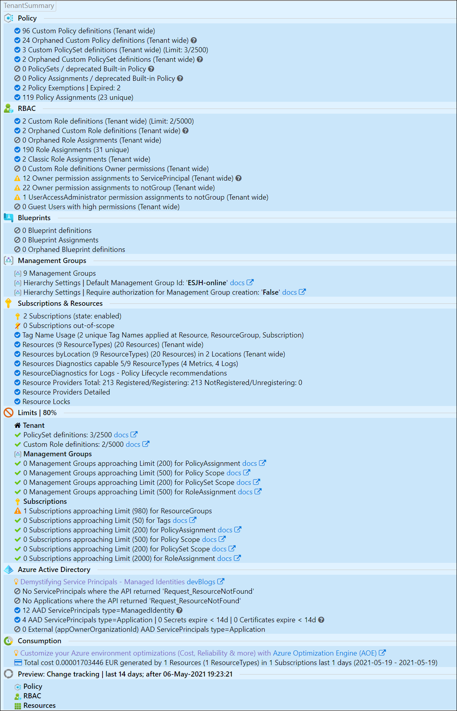

# AzGovViz - Azure Governance Visualizer

Do you want to get granular insights on your technical Azure Governance implementation? - document it in CSV, HTML and MD (Markdown)?  
AzGovViz is a PowerShell based script that iterates your Azure Tenant´s Management Group hierarchy down to Subscription level. It captures most relevant Azure governance capabilities such as Azure Policy, RBAC and Blueprints and a lot more. From the collected data AzGovViz provides visibility on your __HierarchyMap__, creates a __TenantSummary__, creates __DefinitionInsights__ and builds granular __ScopeInsights__ on Management Groups and Subscriptions. The technical requirements as well as the required permissions are minimal.

You can run the script either for your Tenant Root Group or any other Management Group that you have read access on.

<table>
<td>

"_Governance can be a complex thing_.."

Challenges:

 * Holistic overview on governance implementation  
 * Connecting the dots

AzGovViz is intended to help you to get a holistic overview on your technical Azure Governance implementation by connecting the dots.

</td>
<td>

</td>
</table>

## AzGovViz @ Microsoft Cloud Adoption Framework

<table>
<td>

</td>
<td>

Listed as tool for the Govern discipline in the Microsoft Cloud Adoption Framework!  
https://docs.microsoft.com/en-us/azure/cloud-adoption-framework/reference/tools-templates#govern

Included in the Microsoft Cloud Adoption Framework´s [Strategy-Plan-Ready-Gov](https://azuredevopsdemogenerator.azurewebsites.net/?name=strategyplan) Azure DevOps Demo Generator template.

</td>
</table>

## AzGovViz release history

__Breaking Changes__ (2021-Feb-28)

* When granting __Azure Active Directory Graph__ API permissions in the background an AAD Role assignment for AAD Group __Directory readers__ was triggered automatically - since January/February 2021 this is no longer the case. Review the updated [__AzGovViz technical documentation__](#azgovviz-technical-documentation) section for detailed permission requirements.

[full history](history.md)

## AzGovViz in Action

<table>
<td>

[Demo (Version 5; 2021-Feb-12)](https://www.azadvertizer.net/azgovvizv4/demo/AzGovViz_Enterprise-Scale_WingTip_v5_major_20210212_1.html)

</td>
<td>

Enterprise-Scale ([WingTip](https://github.com/Azure/Enterprise-Scale/blob/main/docs/reference/wingtip/README.md)) implementation

</td>
</table>

### Features

* __Hierarchy of Management Groups__
  * Builds a visual hierarchy of your Management Group setup including count of linked Subscriptions
* __Azure Policy__
  * Custom Policy definitions
    * Scope information
    * Policy effect
    * If Policy effect is DeployIfNotExists (DINE) will show the specified RBAC Role 
    * List of assignments
    * Usage in custom PolicySet definitions 
  * Orphaned custom Policy definitions
    * List of custom Policy definitions that matches the following criteria:
      * Policy definition is not used in any custom PolicySet definition
      * No Policy assignment exists for the Policy definition
  * Custom PolicySet definitions
    * Scope information
    * List unique assignments
    * List of Policy definitions used
  * Orphaned custom PolicySet definitions
    * Criteria: no Policy assignment exists for the PolicySet definition
  * Custom PolicySet definitions using deprecated built-in Policy definitions
  * Policy assignments of deprecated built-in Policy definition
  * Policy Exemptions
    * Lists all Exemptions (scopes: Management Groups, Subscriptions, ResourceGroups, Resources)
    * Enrich information on Exemption scope
    * Summary on expired Exemptions
  * Policy assignments throughout the entirety of scopes (Management Groups, Subscriptions)
    * Core information on Policy assignments
    * Advanced information on Policy assignments
      * Policy assignment scope (at scope/inheritance)
      * Indicates if scope is excluded from Policy assignment 
      * Indicates if Exemption applies for scope 
      * Policy/Resource Compliance
      * Related RBAC Role assignments (if Policy effect is DeployIfNotExists (DINE))
* __Role-Based Access Control (RBAC)__
  * Custom Role definitions
    * List assignable scopes
  * Orphaned custom Role definitions
    * List of custom Role definitions that matches the following criteria:
      * Role definition is not used in any Role assignment
  * Orphaned Role assignments
    * List of Role assignments that matches the following criteria:
      * Role definition was deleted although and assignment existed
      * Role assignmet's target identity (User, Group, ServicePrincipal) was deleted
  * Role assignments throughout the entirety of scopes (Management Groups, Subscriptions)
    * Core information on Role assignments
    * Advanced information on Role assignments
      * Role assignment scope (at scope / inheritance)
      * For Role Assignments on Groups the AAD Group members are fully resolved. With this capability AzGovViz can ultimately provide holistic insights on permissions granted
      * For identity-type == 'ServicePrincipal' the type (Application/ManagedIdentity) will be reported
      * For identity-type == 'User' the userType (Member/Guest) will be reported
      * Related Policy assignments (Policy assignment of a Policy definition that uses the DeployIfNotExists (DINE) effect)
  * Security & Best practice analysis
    * Existence of custom Role definition that reflect 'Owner' permissions
    * Role assignments for 'Owner' permissions on identity-type == 'ServicePrincipal' 
    * Role assignments for 'Owner' permissions on identity-type != 'Group'
    * Role assignments for 'UserAccessAdministrator' permissions on identity-type != 'Group'
* __Blueprints__
  * Blueprint scopes and assignments
  * Orphaned Blueprints
* __Management Groups & limits__
  * Management Group count and Management Group level depth
  * Default Management Group
  * Management Groups approaching ARM limits:
    * Policy assignment limit
    * Policy / PolicySet definition scope limit
    * Role assignment limit
* __Subscriptions, Resources & limits__
  * Subscription insights
    * QuotaId, State, Tags, Azure Security Center Secure Score, Cost, Management Group path
    * Subscriptions approaching ARM limits:
      * ResourceGroup limit
      * Subscription Tags limit
      * Policy assignment limit
      * Policy / PolicySet definition scope limit
      * Role assignment limit
  * Tag Name usage
    * Insights on usage of Tag Names on Subscriptions, ResourceGroups and Resources
  * Resources
    * Resource Types
      * ResourceType count per location
      * ResourceType capability for Resource Diagnostics including
        * ResourceType count and information if capable for logs including list of available og categories
        * ResourceType count and information if capable for metrics
      * Lifecyle recommendations for existing Azure Policy definitions that configure Resource diagnostics of type=Log
        * Check if Policy definitions hold the latest set of applicable log categories
        * Recommendation to create Policy definition for ResourceType if supported
        * Lists all PolicyDefinitions that deploy Resource diagnostics of type=log, lists Policy assignments and PolicySet assignments if the Policy defintion is used in a PolicySet definition
      * Resource Provider
        * Resource Provider state aggregation throughout all Subscriptions
        * Explicit Resource Provider state per Subscription
      * Resource Locks
        * Aggregated insights for Lock and respective Lock-type usage on Subscriptions, ResourceGroups and Resources
* __Azure Active Directory (AAD)__
  * Insights on those Service Principals where a Role assignment exists (scopes: Management Group, Subscription, ResourceGroup, Resource):
    * Type=ManagedIdentity
      * Core information on the Service Principal such as related Ids and use case information
    * Type=Application
      * Secrets and Certificates expiry information & warning
      * Report on external Service Principals
* __Consumption__
  * Aggregated consumption insights throughout the entirety of scopes (Management Groups, Subscriptions)

### Screenshots

HTML file

__HierarchyMap__  
  
__TenantSummary__  
  
__DefinitionInsights__  
 
__ScopeInsights__  
  
*_IDs from screenshot are randomized_

markdown in Azure DevOps Wiki as Code

 
*_IDs from screenshot are randomized_

### Outputs

* CSV file
* HTML file
  * the HTML file uses Java Script and CSS files which are hosted on various CDNs (Content Delivery Network). For details review the BuildHTML region in the PowerShell script file.
  * Browsers tested: Edge, new Edge and Chrome
* MD (Markdown) file
  * for use with Azure DevOps Wiki leveraging the [Mermaid](https://docs.microsoft.com/en-us/azure/devops/release-notes/2019/sprint-158-update#mermaid-diagram-support-in-wiki) plugin

> Note: there is some fixing ongoing at the mermaid project to optimize the graphical experience:  
 <https://github.com/mermaid-js/mermaid/issues/1177>

## AzGovViz slideset

Short presentation on AzGovViz [Download](slides/AzGovViz_intro.pdf)

## AzGovViz technical documentation

### Required permissions in Azure

This permission is <b>mandatory</b> in each and every scenario!

<table>
  <tbody>
    <tr>
      <th>Scenario</th>
      <th>Permissions</th>
    </tr>
    <tr>
      <td>Console or AzureDevOps Pipeline</td>
      <td><b>Reader</b> Role assignment on Management Group level</td>
    </tr>
  </tbody>
</table>

### Required permissions in Azure Active Directory / API permissions

<table>
  <tbody>
    <tr>
      <th>Scenario</th>
      <th>Permissions</th>
    </tr>
    <tr>
      <td>Console using a Guest user</td>
      <td>Add to AAD Role <b>Directory readers</b> OR Use parameters: &nbsp;-NoAADGuestUsers &nbsp;-NoAADGroupsResolveMembers &nbsp;-NoAADServicePrincipalResolve</td>
    </tr>
    <tr>
      <td>Console using Service Principal</td>
      <td>
        <b>Option 1</b> (simple setup but more read permissions than required) 
        Add Service Principal to AAD Role <b>Directory readers</b>  
        <b>Option 2</b> (explicit permission model)
        <table>
          <tbody>
            <tr>
              <th>Feature</th>
              <th>Permissions</th>
              <th>Parameter</th>
            </tr>
            <tr>
              <td>Get identity Role assignments</td>
              <td>Service Principal's <b>App registration</b> grant with <b>Azure Active Directory Graph</b> permissions: Application permissions / Directory / Read.All</td>
              <td>n/a</td>
            </tr>
            <tr>
              <td>Get AAD Guest Users</td>
              <td>Service Principal's <b>App registration</b> grant with <b>Microsoft Graph</b> permissions: Application permissions / User / User.Read.All (<a href="https://docs.microsoft.com/en-us/graph/api/user-get#permissions" target="_blank">Get user</a>)</td>
              <td>NoAADGuestUsers</td>
            </tr>
            <tr>
              <td>Get AAD Groups</td>
              <td>Service Principal's <b>App registration</b> grant with <b>Microsoft Graph</b> permissions: Application permissions / Group / Group.Read.All (<a href="https://docs.microsoft.com/en-us/graph/api/group-get#permissions" target="_blank">Get group</a>)</td>
              <td>NoAADGroupsResolveMembers</td>
            </tr>
            <tr>
              <td>Get AAD SP/App</td>
              <td>Service Principal's <b>App registration</b> grant with <b>Microsoft Graph</b> permissions: Application permissions / Application / Application.Read.All (<a href="https://docs.microsoft.com/en-us/graph/api/serviceprincipal-get#permissions" target="_blank">Get servicePrincipal</a>, <a href="https://docs.microsoft.com/en-us/graph/api/application-get#permissions" target="_blank">Get application</a>)</td>
              <td>NoAADServicePrincipalResolve</td>
            </tr>
          </tbody>
        </table>
      </td>
    </tr>
    <tr>
      <td>Azure DevOps Pipeline</td>
      <td>
        <b>Option 1</b> (simple setup but more read permissions than required) 
        Add Azure DevOps Service Connection's Service Principal to AAD Role <b>Directory readers</b>  
        <b>Option 2</b> (explicit permission model)
        <table>
          <tbody>
            <tr>
              <th>Feature</th>
              <th>Permissions</th>
              <th>Parameter</th>
            </tr>
            <tr>
              <td>Get identity Role assignments</td>
              <td>Azure DevOps Service Connection's <b>App registration</b> grant with <b>Azure Active Directory Graph</b> permissions: Application permissions / Directory / Read.All</td>
              <td>n/a</td>
            </tr>
            <tr>
              <td>Get AAD Guest Users</td>
              <td>Azure DevOps Service Connection's <b>App registration</b> grant with <b>Microsoft Graph</b> permissions: Application permissions / User / User.Read.All (<a href="https://docs.microsoft.com/en-us/graph/api/user-get#permissions" target="_blank">Get user</a>)</td>
              <td>NoAADGuestUsers</td>
            </tr>
            <tr>
              <td>Get AAD Groups</td>
              <td>Azure DevOps Service Connection's <b>App registration</b> grant with <b>Microsoft Graph</b> permissions: Application permissions / Group / Group.Read.All (<a href="https://docs.microsoft.com/en-us/graph/api/group-get#permissions" target="_blank">Get group</a>)</td>
              <td>NoAADGroupsResolveMembers</td>
            </tr>
            <tr>
              <td>Get AAD SP/App</td>
              <td>Azure DevOps Service Connection's <b>App registration</b> grant with <b>Microsoft Graph</b> permissions: Application permissions / Application / Application.Read.All (<a href="https://docs.microsoft.com/en-us/graph/api/serviceprincipal-get#permissions" target="_blank">Get servicePrincipal</a>, <a href="https://docs.microsoft.com/en-us/graph/api/application-get#permissions" target="_blank">Get application</a>)</td>
              <td>NoAADServicePrincipalResolve</td>
            </tr>
          </tbody>
        </table>
      </td>
    </tr>
  </tbody>
</table>

### Usage

#### PowerShell

* Requires PowerShell Az Modules
  * Az.Accounts
  * Az.Resources
  * Az.ResourceGraph
* Usage
  * `.\AzGovVizParallel.ps1 -ManagementGroupId <your-Management-Group-Id>`
* Parameters
  * `-ManagementGroupId` Tenant Id or any child Management Group Id
  * `-CsvDelimiter` the world is split into two kind of delimiters - comma and semicolon - choose yours
  * `-OutputPath`
  * `-AzureDevOpsWikiAsCode`
  * `-DoNotShowRoleAssignmentsUserData` scrub personally identifiable information (PII)
  * `-LimitCriticalPercentage` limit warning level, default is 80%
  * ~~`-HierarchyTreeOnly`~~ `-HierarchyMapOnly` output only the __HierarchyMap__ for Management Groups including linked Subscriptions
  * `-SubscriptionQuotaIdWhitelist` process only Subscriptions with defined QuotaId(s)
  * `-NoResourceProvidersDetailed` disables output for ResourceProvider states for all Subscriptions in the __TenantSummary__ section, in large Tenants this can become time consuming
  * `-NoASCSecureScore` disables ASC Secure Score request for Subscriptions. The used API is in preview you may want to disable this
  * ~~`-DisablePolicyComplianceStates`~~ `-NoPolicyComplianceStates` will not query policy compliance states. You may want to use this parameter to accellerate script execution or when receiving error 'ResponseTooLarge'. 
  * `-NoResourceDiagnosticsPolicyLifecycle` disables Resource Diagnostics Policy Lifecycle recommendations
  * `-NoAADGroupsResolveMembers` disables resolving Azure Active Directory Group memberships
  * `-NoAADGuestUsers` disables resolving Azure Active Directory User type (Guest or Member)
  * ~~`-NoServicePrincipalResolve`~~ `-NoAADServicePrincipalResolve` disables resolving ServicePrincipals
  * ~~`-ServicePrincipalExpiryWarningDays`~~ `-AADServicePrincipalExpiryWarningDays` define warning period for Service Principal secret and certificate expiry; default is 14 days
  * `-NoAzureConsumption` Azure Consumption data should not be collected/reported
  * `-AzureConsumptionPeriod` define for which time period Azure Consumption data should be gathered; default is 1 day
  * `-NoAzureConsumptionReportExportToCSV` Azure Consumption data should not be exported (CSV)
  * `-NoScopeInsights` - Q: Why would you want to do this? A: In larger tenants the ScopeInsights section blows up the html file (up to unusable due to html file size)
  * `-ThrottleLimit` - Leveraging PowerShell´s parallel capability you can define the ThrottleLimit (default=5)
  * `-DoTranscript` - Log the console output
  * ~~`-UseAzureRM`~~ support for AzureRm modules has been deprecated
* Passed tests: Powershell Core 7.1.1 on Windows
* ~~Passed tests: Powershell 5.1.18362.752 on Windows~~
* Passed tests: Powershell Core 7.1.1 Azure DevOps hosted ubuntu-18.04

#### Azure DevOps Pipeline

The provided example Pipeline is configured to run based on a [schedule](https://docs.microsoft.com/en-us/azure/devops/pipelines/process/scheduled-triggers) (every 12 hours). It will push the AzGovViz markdown output file to the 'wiki' folder in the 'Azure-MG-Sub-Governance-Reporting' Repository which will feed your Wiki.

1. In Azure DevOps make sure to [enable](https://docs.microsoft.com/en-us/azure/devops/project/navigation/preview-features?view=azure-devops&tabs=new-account-enabled) the Multistage Pipelines feature <https://docs.microsoft.com/en-us/azure/devops/pipelines/get-started/multi-stage-pipelines-experience?view=azure-devops>
2. Clone the AzGovViz Repo
3. Create Pipeline, configure your pipeline selecting __Existing Azure Pipelines YAML file__, select the AzGovViz YAML from the AzGovViz (Azure-MG-Sub-Governance-Reporting) Repo
4. Grant Repository permissions: In order to allow the pipeline to push files back to our 'wiki' folder in the 'Azure-MG-Sub-Governance-Reporting' Repository the __Build Service__ Account ('%ProjectName% Build Service (%OrgName%)') must be granted with __Contribute__ permission  

5. Run the Pipeline
6. Create Wiki by choosing [Publish Code as Wiki](https://docs.microsoft.com/en-us/azure/devops/project/wiki/publish-repo-to-wiki?view=azure-devops&tabs=browser), define the folder 'wiki' from the 'Azure-MG-Sub-Governance-Reporting' Repository as source

> Make sure your Service Connection has the required permissions (see [__Required permissions in Azure__](#required-permissions-in-azure)).

## AzGovViz sidenotes

### Security

AzGovViz creates very detailed information about your Azure Governance setup. In your organization's best interest the __outputs should be protected from not authorized access!__

### Facts

Disabled Subscriptions and Subscriptions where Quota Id starts with with "AAD_" are being skipped, all others are queried. More info on Quota Id / Offer numbers: <a href="https://docs.microsoft.com/en-us/azure/cost-management-billing/costs/understand-cost-mgt-data#supported-microsoft-azure-offers" target="_blank">Supported Microsoft Azure offers</a> 
.  

ARM Limits are not acquired programmatically, they are hardcoded. The links used to check related Limits are commented in the param section of the script.

### Contributions

Please feel free to contribute. Thanks to so many supporters - testing, giving feedback, making suggestions, presenting use-case, posting/blogging articles, refactoring code - THANK YOU!

Thanks Stefan Stranger (Microsoft) for providing me with his AzGovViz outputs executed on his implementation of EnterpriseScale. Make sure you read Stefan´s Blog Article: <a href="https://stefanstranger.github.io/2020/08/28/EnterpriseScalePolicyDrivenGovernance/" target="_blank">Enterprise-Scale - Policy Driven Governance</a> 

Thanks Frank Oltmanns-Mack (Microsoft) for providing me with his AzGovViz outputs executed on his implementation of EnterpriseScale (see latest [__demo__](#demo)).

Special thanks to Tim Wanierke, Brooks Vaughn and Friedrich Weinmann (Microsoft).

Kudos to the <a href="https://www.tablefilter.com/" target="_blank">TableFilter</a> Project Team!

## AzAdvertizer

Also check <https://www.azadvertizer.net> - AzAdvertizer helps you to keep up with the pace by providing overview and insights on new releases and changes/updates for Azure Governance capabilities such as Azure Policy's Policy definitions, initiatives (Set definitions), aliases and Azure RBAC's Role definitions and resource provider operations.

## Final Note

Please note that while being developed by a Microsoft employee, AzGovViz is not a Microsoft service or product. AzGovViz is a personal/community driven project, there are none implicit or explicit obligations related to this project, it is provided 'as is' with no warranties and confer no rights.