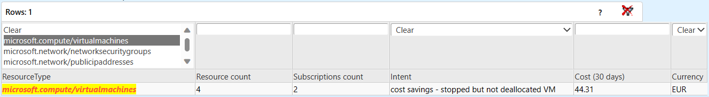

# Azure Governance Visualizer aka AzGovViz

## Azure Governance Visualizer version history

### Azure Governance Visualizer version 6

**Changes** (2024-July-15 / 6.4.12 Minor)

- ALZ policy refresh H2 FY24 (initiatives.json)
- [DevSkim](https://github.com/microsoft/DevSkim-Action), [PSScriptAnalyzer](https://github.com/microsoft/psscriptanalyzer-action) and [OpenSSF Scorecard](https://github.com/ossf/scorecard?tab=readme-ov-file#scorecard-github-action) integration
- fixes and optimization based on DevSkim, PSScriptAnalyzer and OpenSSF Scorecard findings
- api version mapping in param block for cloud environment api version availability drift
- update GitHub workflows to use azure/login@v2 (previous: azure/login@v1):
  - [AzGovViz_OIDC.yml](/.github/workflows/AzGovViz_OIDC.yml)
  - [AzGovViz.yml](/.github/workflows/AzGovViz.yml)
- update getConsumption (experimental for now): instead of full Management Group scope costmanagement data retrieval, batch by Subscription quotaId in batches of 100. Failing batches and batches of Subscriptions of quotaId `CSP_2015-05-01` (see param block variable `SubscriptionQuotaIdsThatDoNotSupportCostManagementManagementGroupScopeQuery`) will fallback to get costmanagement data per Subscription. In order to use this you must update the AzGovVizParallel.ps1 file to use the function `getConsumptionv2` instead of `getConsumption`
- html; update jquery; source tablefilter js
- update `.devcontainer/devcontainer.json`
- use [AzAPICall](https://aka.ms/AzAPICall) PowerShell module version 1.2.3 (Handle costManagement error `SubscriptionCostDisabled`)

**Changes** (2024-May-05 / 6.4.5 Minor)

- updated orphaned resources queries following the source repository [Azure Orphan Resources - GitHub](https://github.com/dolevshor/azure-orphan-resources/blob/111a7ea4ced2016760b1b95544f298b9b4be8dee/Queries/orphan-resources-queries.md) with slight adjustments
- covering _I´ll call it_ 'tenant/service level Role definitions'
- optimize/bug fix 'Processing roleDefinitions used in policyDefinitions'
- increase the default value for `-AzureConsumptionPeriod` from `1` to `2` - if the Azure Governance Visualizer is executed early in the day, consumption data may not be accurate enough.. (reminder: the switch parameter `-DoAzureConsumption` must be set to `true` for the consumption data collection to kick in)
- update default value for parameter `-ValidPolicyEffects`
- update [API reference](#api-reference) Microsoft.Authorization/roleDefinitions use API version 2023-07-01-preview (previous 2022-05-01-preview)
- update [API reference](#api-reference) Microsoft.ResourceGraph/resources use API version 2022-10-01 (previous 2021-03-01)
- update [API reference](#api-reference) Microsoft.CostManagement/query use API version 2024-01-01 (previous 2023-03-01)

**Changes** (2024-Apr-17 / 6.4.4 Minor)

- fix issue #230
  - use [AzAPICall](https://aka.ms/AzAPICall) PowerShell module version 1.2.1
- update [API reference](#api-reference) Microsoft.Security/pricings use API version 2024-01-01 (previous 2018-06-01)
- add 'Mutate' to `ValidPolicyEffects`
- location related tasks - use only physical locations (exclude logical)
- optimize collection of Role definitions that are used in Policy definitions

**Changes** (2024-Mar-19 / 6.4.3 Minor)

- Support for `-DoAzureConsumptionPreviousMonth` - Azure Consumption data should be collected/reported for the previous month

**Changes** (2024-Mar-14 / 6.4.2 Minor)

- optimize objects handling / best practices

**Changes** (2024-Feb-06 / 6.4.0 Minor)

- change PowerShell parallel handling / batches
- add addition JSON outputs 'definitions_tracking' and 'assignments_tracking' (JSON filenames have no displayName included; GUIDs only)
- update ARM API-version for RBAC Role definitions. Using `2022-05-01-preview` instead of `2018-11-01-preview` consequently
- fix \*\_roleDefinitions.csv - description partially missing
- optimize array handling / best practices
- optimize getting private endpoint capable resource types / in case resource provider 'microsoft.network' is not registered, try with next available subscription instead of throwing
- use [AzAPICall](https://aka.ms/AzAPICall) PowerShell module version 1.2.0
- documentation update - style guidance, links updates - kudos @ckittel

**Changes** (2024-Jan-08 / 6.3.7 Minor)

- fix: Ignore `ARMLocation` in case not Public Cloud (AzureCloud)

**Changes** (2023-Dec-17 / 6.3.6 Minor)

- fix: processing of Service Principal names that contain special characters
- fix: RBAC reporting correct RBAC Role assignment related Policy assignment Policy definition displayName
- update ARM API-version for CostManagement. Using `2023-03-01` instead of `2019-11-01`

**Changes** (2023-Dec-15 / 6.3.5 Minor)

- Checking if the response of the storage account properties request is a byte array (type 'byte[]') and decode it to a string
- Different handling of BOM (Byte order mark) for XML returns on storage account properties request (since Powershell version 7.4.0)
- use [AzAPICall](https://aka.ms/AzAPICall) PowerShell module version 1.1.85

**Changes** (2023-Nov-13 / 6.3.4 Minor)

- introduce new parameter `-ARMLocation`. Define the Azure Resource Manager (ARM) location to use (default is to use westeurope; this is used to optimize the built-in Azure RBAC Role definitions tracking)
- hardening the automated AzAPICall PowerShell module installation by adding retry mechanism in case of failure (Azure DevOps/GitHub)
- tolerating more up to date AzAPICall version when executing outside of Azure DevOps/GitHub
- update ARM API-version for Resources. Using `2023-07-01` instead of `2021-04-01`
- update `/.azuredevops/pipelines/AzGovViz.variables.yml`
  - add parameter `-ARMLocation`
- update README.md
  - update [API reference](#api-reference)
- use [AzAPICall](https://aka.ms/AzAPICall) PowerShell module version 1.1.84

**Changes** (2023-Oct-22 / 6.3.3 Minor)

- introduce new optional parameter `-AzAPICallSkipAzContextSubscriptionValidation` [ref](https://aka.ms/AzAPICall)
- update ARM API-version for RBAC Role definitions. Using `2022-05-01-preview` instead of `2018-11-01-preview`. This will show us 'conditions' [example](https://www.azadvertizer.net/azrolesadvertizer/8b54135c-b56d-4d72-a534-26097cfdc8d8.html)
- update `/.azuredevops/pipelines/AzGovViz.variables.yml`
  - add parameter `-AzAPICallSkipAzContextSubscriptionValidation`
  - structure AzAPICall related variables
  - Azure Active Directory becomes Microsoft Entra ID
- update README.md and setup.md
  - OIDC for Azure DevOps
  - update [API reference](#api-reference)
  - Azure Active Directory becomes Microsoft Entra ID
- use [AzAPICall](https://aka.ms/AzAPICall) PowerShell module version 1.1.83

**Changes** (2023-Sep-12 / 6.3.2 Minor)

- another fix for [AzAPICall issue43](https://github.com/JulianHayward/AzAPICall/issues/43). Use-case scenario will be documented in the near future. Kudos to Asbjørn Nielsen (fellowmind dk) @AsbjornNielsen
- use [AzAPICall](https://aka.ms/AzAPICall) PowerShell module version 1.1.79

**Changes** (2023-Sep-04 / 6.3.1 Minor)

- introduce new optional parameter `-TenantId4AzContext` which makes it possible to set the Azure context to a different tenant. Fix for [AzAPICall issue43](https://github.com/JulianHayward/AzAPICall/issues/43). Use-case scenario will be documented in the near future. Kudos to Asbjørn Nielsen (fellowmind dk) @AsbjornNielsen
- update `/.azuredevops/pipelines/AzGovViz.variables.yml`
- use [AzAPICall](https://aka.ms/AzAPICall) PowerShell module version 1.1.78

**Changes** (2023-Aug-02 / 6.3.0 Minor)

- workaround for [issue121](https://github.com/JulianHayward/Azure-MG-Sub-Governance-Reporting/issues/121); remove files hitting the GitHub file size limit [ref](https://docs.github.com/en/repositories/working-with-files/managing-large-files/about-large-files-on-github#file-size-limits)
  - update GitHub workflows:
    - [AzGovViz_OIDC.yml](/.github/workflows/AzGovViz_OIDC.yml)
    - [AzGovViz.yml](/.github/workflows/AzGovViz.yml)

**Changes** (2023-Jul-19 / 6.3.0 Minor)

- update feature **UserAssigned Managed Identities assigned to Resources / vice versa**
  - show if UAMI is used cross subscription (**TenantSummary**, **ScopeInsights** & CSV output)

**Changes** (2023-Jul-17)

- update to Azure DevOps Pipeline v6_major_20230717_1 [AzGovViz.pipeline.yml](./.azuredevops/pipelines/AzGovViz.pipeline.yml)
  - Output of published WebApp URL
- update README.md and setup.md - add reference to the [Azure Governance Visualizer accelerator](https://github.com/Azure/Azure-Governance-Visualizer-Accelerator)

**Changes** (2023-Jun-23 / 6.2.3 Minor)

- fix feature 'network' - optimize handling of unknown Subscription Ids

**Changes** (2023-Jun-16 / 6.2.1 Minor)

- fix feature diagnostic capable resource name containing "+"

**Changes** (2023-Apr-24 / 6.2.0 Minor)

- fix handling of `DisallowedProvider` responses; issue #184

**Changes** (2023-Mar-30 / 6.1.0 Major)

- Update to semantic versioning
  - the version.txt becomes obsolete
  - the new file for version check is version.json
- Add updatedBy/updatedOn metadata for RBAC Role assignments
- Add least privilege check for script execution in the context of a user for Azure Resource permissions (at this time it only checks permissions on the target Management Group Id) - best practice is to execute as a Service Principal with least privilege
- Use [AzAPICall](https://aka.ms/AzAPICall) PowerShell module version 1.1.72
  - add AzAPICall version information in AzAPICall outputs
  - if context is user then get the users objectId (required for least privilege check)

**Changes** (2023-Mar-25 / Major)

- Fix issue #[176](https://github.com/JulianHayward/Azure-MG-Sub-Governance-Reporting/issues/176) / occured when secureScores API returns multiple values

**Changes** (2023-Mar-23 / Major)

- Use [AzAPICall](https://aka.ms/AzAPICall) PowerShell module version 1.1.71
  - handle `RequestTimeout`

**Changes** (2023-Mar-20 / Major)

- Fix/update feature Policy Remediation
  - Optimze the Azure Resource Graph query by adding sort, due to duplicates/missing entries for results > 1k
- **Analysis** on issue #[175](https://github.com/JulianHayward/Azure-MG-Sub-Governance-Reporting/issues/175) (no real explanation, but fixed by using `IsNullOrWhiteSpace` instead of `IsNullOrEmpty`)

```powershell
$htdetails0 = @"
{
    "then": {
        "details": [
            {
                "field": "Microsoft.ContainerInstance/containerGroups/diagnostics.logAnalytics.workspaceId",
                "value": "[parameters('workspaceId')]"
            }
        ]
    }
}
"@
$htdetails1 = @"
{
    "then": {
        "details": [
            {
                "field": "Microsoft.ContainerInstance/containerGroups/diagnostics.logAnalytics.workspaceId",
                "value": "[parameters('workspaceId')]"
            },
            {
                "field": "Microsoft.ContainerInstance/containerGroups/diagnostics.logAnalytics.workspaceKey",
                "value": "[parameters('workspaceKey')]"
            }
        ]
    }
}
"@

$obj0 = $htdetails0 | ConvertFrom-Json
if (-not [string]::IsNullOrEmpty($obj0.then.details.roleDefinitionIds)) {
    Write-Host 'obj0 roleDefinitionIds not empty'
}
else {
    Write-Host 'obj0 roleDefinitionIds empty'
}

$obj1 = $htdetails1 | ConvertFrom-Json
if (-not [string]::IsNullOrEmpty($obj1.then.details.roleDefinitionIds)) {
    Write-Host 'obj1 roleDefinitionIds not empty'
}
else {
    Write-Host 'obj1 roleDefinitionIds empty'
}
```

**Changes** (2023-Mar-17 / Major)

- Fix issue #[175](https://github.com/JulianHayward/Azure-MG-Sub-Governance-Reporting/issues/175) / occured with new policy definition [Configure diagnostics for container group to log analytics workspace (21c469fa-a887-4363-88a9-60bfd6911a15)](https://www.azadvertizer.net/azpolicyadvertizer/21c469fa-a887-4363-88a9-60bfd6911a15.html). Cache built-in Policy definitions failed.

**Changes** (2023-Mar-15 / Major)

- Enhance **TenantSummary**/Subscriptions information with Advisor scores + CSV export \*\_SubscriptionDetails.csv
- Fix feature Policy Remediation
  - Exclude policy/assignments from out-of-scope scopes from processing (e.g. disabled subscription)
- Fix `-NoCsvExport` parameter reliability

**Changes** (2023-Mar-08 / Major)

- Extended the 'Cost optimization & cleanup' feature (HTML **TenantSummary**/Subscriptions, Resources & Defender) with application gateways with empty backend pools' - thanks @sebassem
- New feature Policy Remediation (HTML **TenantSummary**/Policy, CSV export)
  - Fix: it is indeed possible that no Policy definitions require remediation
- Update `/.azuredevops/pipelines/AzGovViz.pipeline.yml` and `/.azuredevops/pipelines/AzGovViz.variables.yml`. Added guidance (issue [#173](https://github.com/JulianHayward/Azure-MG-Sub-Governance-Reporting/issues/173)): if using the publish to webApp feature the ManagementGroupId variable must have correct casing (Linux!=linuX)
- Minor optimizations

**Changes** (2023-Mar-06 / Major)

- New feature: Custom Policy definitions that have 'Policy rule' parity with built-in Policy definition(s) (HTML **TenantSummary**/Policy and CSV output)
- Enhanced \*\_PolicyAll.json output to include Policy assignments
- Optimize method to detect Policy definition effect
- Optimize consumption / convert to decimal
- Renamed the 'Orphaned Resources' feature to 'Cost optimization & cleanup'
  - Renamed CSV output '\_\*ResourcesOrphaned.csv' to '\_\*ResourcesCostOptimizationAndCleanup.csv'
- &#128640; Highlight contribution by @TimWanierke: Extended the 'Cost optimization & cleanup' feature (HTML **TenantSummary**/Subscriptions, Resources & Defender) with 'stopped but not deallocated' Virtual Machines including the related cost
  
- Use [AzAPICall](https://aka.ms/AzAPICall) PowerShell module version 1.1.70
  - minor fixes; not Azure Governance Visualizer specific
- Added new section [Trust?!](#trust)
- Typ0s and minor fixes
- Transitioning product name 'AzGovViz' to 'Azure Governance Visualizer aka AzGovViz' as folks tend to interpretate the 'Gov' as government and not as governance

**Changes** (2023-Mar-02 / Major)

- Extended the Orphaned Resource with the capability to see "Stopped" virtual machines. These stopped virtual machines are still generated costs. You better should set these virtual machines to "Stopped (deallocated)" to save costs.

**Changes** (2023-Feb-13 / Major)

- Optimize 'Storage Account Analysis' feature
  - update API call
  - add cost
- Optimize CSV output for PIM Eligibility / better Git change tracking
- Optimize CSV output for Virtual Networks / better Git change tracking
- Updated [API reference](#api-reference)

**Changes** (2023-Feb-10 / Major)

- Fix 'Storage Account Analysis' feature
  - handle non returned 'Used Capacity' metric

**Changes** (2023-Feb-03 / Major)

- Update 'Orphaned Resources' feature
  - subscriptions in a tenant can have varying currency / output 'cost savings' per currency
- Update 'Storage Account Analysis' feature
  - add 'Used Capacity' metric
- Fix 'Network - Virtual Network Peerings' feature CSV output
  - join Address prefixes
  - join DNS Servers
- Fix 'PIM Eligibility' feature
  - orphaned subscription scopes may be returned as PIM onboarded scopes, skip subscriptions that have not been returned from the initial list subscriptions call
- Fix 'Azure Landing Zones Policy Version Checker' feature
  - deprecated ALZ policy/set resolve to state 'deprecated'
- Export Resource Locks details as CSV

**Changes** (2023-Feb-01 / Major)

- Update 'Orphaned Resources' feature
  - change intent for `microsoft.web/serverfarms` from 'clean up' to 'cost savings'
  - update orphaned disks query according to [github.com/dolevshor/azure-orphan-resources PR#5](https://github.com/dolevshor/azure-orphan-resources/pull/5/files) - thanks @eklime

**Changes** (2023-Jan-24 / Major)

- Use [AzAPICall](https://aka.ms/AzAPICall) PowerShell module version 1.1.68
  - fix issue for Private DNS Zone resource diagnostics capability check

**Changes** (2023-Jan-19 / Major)

- Cover Preview [Azure Storage Account with Azure DNS zone endpoints](https://learn.microsoft.com/azure/storage/common/storage-account-overview#azure-dns-zone-endpoints-preview) ([Issue #164](https://github.com/JulianHayward/Azure-MG-Sub-Governance-Reporting/issues/164))
- Add feature to simulate Management Group Hierarchy Map
- New parameter `-HierarchyMapOnlyCustomData` (documentation update pending)
- Private Endpoint feature - add Microsoft tenants (cross tenant PE) (`-MSTenantIds`)
- Use [AzAPICall](https://aka.ms/AzAPICall) PowerShell module version 1.1.67

**Changes** (2023-Jan-06 / Major)

- Fix issue PIM eligibility (do not process out-of-scope subscriptions) [issue #161](https://github.com/JulianHayward/Azure-MG-Sub-Governance-Reporting/issues/161)
- Collect Advisor Scores foreach subscription
- Update DailySummary
  - Add count of subscriptions per quotaId
  - Add 'Microsoft Defender for Cloud' Secure Score for Management Groups
- Updated [API reference](#api-reference)
- Use [AzAPICall](https://aka.ms/AzAPICall) PowerShell module version 1.1.65

**Changes** (2023-Jan-03 / Major)

- Fix issue for Private Endpoints feature
  - Subscription may not be registered for location / skip
- Use [AzAPICall](https://aka.ms/AzAPICall) PowerShell module version 1.1.64
- Add ShowMemoryUsage at creation of **DefinitionInsights**

**Changes** (2022-Dec-29 / Major)

- Fix issue for Private Endpoints feature

**Changes** (2022-Dec-28 / Major)

- Instead of trying to get full properties of all resource types only approach available Private Endpoint resource types
- Use [AzAPICall](https://aka.ms/AzAPICall) PowerShell module version 1.1.63
  - Optimize error output for unknown convertFrom-JSON errors
- Updated [API reference](#api-reference)
- &#128640; By the way - checkout the updated 'well performing' [**Az**`Alias`**Advertizer**](https://www.azadvertizer.net/azpolicyaliasesadvertizer_singlelines.html)
- Fix: lock-in the synchrsonized hashTable `htResourcePropertiesConvertfromJSONFailed` in dataCollectionFunctions foreach parallel loop

**Changes** (2022-Dec-22 / Major)

- Fix issue for Private Endpoints feature
- Add reference for Microsoft Defender for Cloud security alerts on AzGovViz activity - [Security](#security)
- Fix for migrated Subscriptions. In rare cases a subscription that was migrated to another tenant may still be returned from the [Entities ARM API](https://learn.microsoft.com/rest/api/managementgroups/entities/list), but not from the [Subscriptions ARM API](https://learn.microsoft.com/rest/api/resources/subscriptions/list) - if that is the case then these subscriptions will be added to the out-of-scope subscriptions collection
- Use [AzAPICall](https://aka.ms/AzAPICall) PowerShell module version 1.1.62
  - Fix issue [155](https://github.com/JulianHayward/Azure-MG-Sub-Governance-Reporting/issues/155) AzureChinaCloud
- Minor optimizations
  - Using parameter `-ManagementGroupsOnly`
  - Using parameter `-HierarchyMapOnly`
  - Overall script optimizations

**Changes** (2022-Dec-13 / Major)

- Fix for sovereign clouds - replace hardcoded ARM endpoint uri with dynamic ([issue #155](https://github.com/JulianHayward/Azure-MG-Sub-Governance-Reporting/issues/155))
- Update Azure Devops Pipeline YAML
  - Add `microsoft.chaos/chaosexperiments`to `-ExcludedResourceTypesDiagnosticsCapableParameters` parameter defaults

**Changes** (2022-Dec-12 / Major)

- Pausing 'PSRule for Azure' integration. AzGovViz leveraged the Invoke-PSRule cmdlet, but there are certain [resource types](https://github.com/Azure/PSRule.Rules.Azure/blob/ab0910359c1b9826d8134041d5ca997f6195fc58/src/PSRule.Rules.Azure/PSRule.Rules.Azure.psm1#L1582) where also child resources need to be queried to achieve full rule evaluation.
- Enhance Private Endpoints feature / cross tenant PE
- Fix for migrated Subscriptions. In rare cases a subscription that was migrated to another tenant may still be returned from the [ARM API](https://learn.microsoft.com/rest/api/resources/subscriptions/list), if that is the case then these subscriptions will be added to the out-of-scope subscriptions collection
- Update Azure Devops Pipeline YAML
  - Enhance error handling if Management Group Id containing spaces is provided - thanks @cbezenco
- Use [AzAPICall](https://aka.ms/AzAPICall) PowerShell module version 1.1.59

**Changes** (2022-Dec-07 / Major)

- Minor change on Storage Account Access Analyisis feature HTML

**Changes** (2022-Dec-04 / Major)

- PSRule for Azure fix | Get resources using ARM API inside Foreach-Object -parallel loop
- Private Endpoints
  - fix resource identification
  - add cross tenant detection
- Storage Account Access Analysis - add insights on 'Allowed Copy Scope' and 'Allow Cross Tenant Replication'
- Updated [API reference](#api-reference)
- Cosmetics
- Bugfixes

**Changes** (2022-Nov-29 / Major)

- Network analysis - fix TenantSummary info if feature is disabled (`-NoNetwork`)
- Use [AzAPICall](https://aka.ms/AzAPICall) PowerShell module version 1.1.55
- Updated TenantSummary screenshot issue #148

**Changes** (2022-Nov-28 / Major)

- Network analysis - fix Private Endpoints feature
  - Handle manual manualPrivateLinkServiceConnections
- Update parameter `-ExcludedResourceTypesDiagnosticsCapable` default with `microsoft.chaos/chaosexperiments`

**Changes** (2022-Nov-21 / Major)

- Network analysis - new features
  - Subnets
    - new parameter `-NetworkSubnetIPAddressUsageCriticalPercentage` warning level when certain percentage of IP addresses is used (default = 90%). Kudos to @ElanShudnow [AzSubnetAvailability - GitHub](https://github.com/ElanShudnow/AzureCode/tree/main/PowerShell/AzSubnetAvailability)
  - Private Endpoints
- Enhance Network feature - Virtual Networks and Virtual Network Peerings
- Use [AzAPICall](https://aka.ms/AzAPICall) PowerShell module version 1.1.54
  - another retry mechanism fix
- Bugfix PIM eligible / Guest User - thanks @nanigan
- Updated [API reference](#api-reference)

**Changes** (2022-Nov-18 / Major)

- Use [AzAPICall](https://aka.ms/AzAPICall) PowerShell module version 1.1.53
  - retry mechanism fix

**Changes** (2022-Nov-17 / Major)

- Update Azure DevOps pipeline YAML
  - checkout `fetchDepth: 1`
    [Azure DevOps pipelines shallow fetch =1 is now default](https://dev.to/kkazala/azure-devops-pipelines-shallow-fetch-1-is-now-default-4656)
  - pool `vmImage: 'ubuntu-22.04'`
- Use [AzAPICall](https://aka.ms/AzAPICall) PowerShell module version 1.1.52
  - retry mechanism fix

**Changes** (2022-Nov-13 / Major)

- Network analysis - VNet peerings detect cross tenant peering -> triggered by @TimWanierke, thanks!
- Updated Storage Account Analysis to handle error 'AuthorizationPermissionMismatch'
- Updated orphaned resources query for punlic IP addressen following the source repository [Azure Orphan Resources - GitHub](https://github.com/dolevshor/azure-orphan-resources/commit/52ea4f12626f62338f5c354a74bf429c1244c382)
- Use [AzAPICall](https://aka.ms/AzAPICall) PowerShell module version 1.1.50
- Update **[Contribution Guide](contributionGuide.md)**

**Changes** (2022-Nov-01 / Minor)

- Updated Storage Account analysis to handle permission issues on databricks storage accounts

**Changes** (2022-Oct-31 / Major)

- New feature - Network analysis (**TenantSummary** and CSV export)
  - Virtual Networks
  - Virtual Network Peerings
- New parameter `-NoResourceProvidersAtAll` - processing Resource Providers in large tenants can consume a lot of memory / increase processing time significantly
- Fix issue #139
- Update `*_DailySummary.csv` with orphaned resources costs (disks, public IP addresses) - thanks @kaiaschulz
- Slight adjustment on `*_RoleAssignments.csv` output - rename column tenOrMgOrSubOrRGOrRes to scopeTenOrMgOrSubOrRGOrRes
- Publish .vscode
- Use [AzAPICall](https://aka.ms/AzAPICall) PowerShell module version 1.1.45
- Minor optimizations
- Add reference to [Media](#media): Microsoft Tech Talks - Bevan Sinclair (Cloud Solution Architect Microsoft) [Automated Governance Reporting in Azure (MTT0AEDT)](https://mtt.eventbuilder.com/event/66431) (register to view)

**Changes** (2022-Oct-19 / Major)

- Fix error for feature 'Storage Account Access Analysis' in sovereign clouds
- Use [AzAPICall](https://aka.ms/AzAPICall) PowerShell module version 1.1.43

**Changes** (2022-Oct-11 / Major)

- Optimized handling of faulty Microsoft Defender for Cloud Email notifications configuration
- Optimized handling of deviating xml data response for Storage Accounts (restype=service&comp=properties)
- Use [AzAPICall](https://aka.ms/AzAPICall) PowerShell module version 1.1.34

**Changes** (2022-Oct-05 / Major)

- Use [AzAPICall](https://aka.ms/AzAPICall) PowerShell module version 1.1.33

**Changes** (2022-Oct-04 / Major)

- New feature to report on Microsoft Defender for Cloud Email notifications configuration for Subscriptions. Data is provided in the HTML **TenantSummary** (Subscriptions, Resources & Defender) and **ScopeInsights**
  - Updated [API reference](#api-reference)
- Further enrich Subscription insights **TenantSummary** (Subscriptions, Resources & Defender) - Owner & User Access Administrator Role assignment count (at scope) direct and indirect, plus PIM eligibility count
- Use [AzAPICall](https://aka.ms/AzAPICall) PowerShell module version 1.1.31

**Changes** (2022-Sep-30 / Major)

- Fix issue #135
  - Embedded GitHub Actions OIDC (Open ID Connect) specific functionality to reconnect and get new token ([AzAPICall](https://aka.ms/AzAPICall))
  - New parameter `-GitHubActionsOIDC` which is only to be used for GitHub Actions `/.github/workflows/AzGovViz_OIDC.yml`
  - Updated `/.github/workflows/AzGovViz_OIDC.yml` to use the new parameter `-GitHubActionsOIDC`
- Fix issue #136
  - Handle return for Storage Accounts located in managed Resource Groups
    &#127800; Call for contribution: Please review the list of known [managed Resource Groups](https://github.com/JulianHayward/AzSchnitzels/blob/main/info/managedResourceGroups.txt) and contribute if you can, thanks!
- Added missing variable `NoStorageAccountAccessAnalysis` in `.azuredevops/pipelines/AzGovViz.variables.yml`
- Use [AzAPICall](https://aka.ms/AzAPICall) PowerShell module version 1.1.30

**Changes** (2022-Sep-28 / Major)

- New feature 'Storage Account Access Analysis' - provides insights on Storage Accounts with focus on anonymous access (containers/blobs and 'Static website' feature). Data is provided in the HTML **TenantSummary** (Subscriptions, Resources & Defender) and as CSV export
  - New parameter `-NoStorageAccountAccessAnalysis` - do not execute the feature
  - New parameter `-StorageAccountAccessAnalysisSubscriptionTags` - define the Subscription tags that should be added to the CSV output
  - New parameter `-StorageAccountAccessAnalysisStorageAccountTags` - define the Storage Account (resource) tags that should be added to the CSV output
  - Updated `.azuredevops/pipelines/AzGovViz.variables.yml` accordingly
- Rename 'ALZ EverGreen' feature to 'Azure Landing Zones (ALZ) Policy Version Checker'
  - Replaced parameter ~~`-NoALZEverGreen`~~ with `-NoALZPolicyVersionChecker`
- Use [AzAPICall](https://aka.ms/AzAPICall) PowerShell module version 1.1.24
- Optimizations

**Changes** (2022-Sep-17 / Major)

- Fix Azure DevOps Pipeline correct addressing of NoDefinitionInsights variable in YAML
- Fix issue #132
- Add **[Contribution Guide](contributionGuide.md)**

**Changes** (2022-Sep-12 / Major)

- New feature 'ALZ EverGreen' - Azure Landing Zones EverGreen for Policy and Set definitions. AzGovViz will clone the ALZ GitHub repository and collect the ALZ policy and set definitions history. The ALZ data will be compared with the data from your tenant so that you can get lifecycle management recommendations for ALZ policy and set definitions that already exist in your tenant plus a list of ALZ policy and set definitions that do not exist in your tenant. The ALZ EverGreen results will be displayed in the **TenantSummary** and a CSV export `*_ALZEverGreen.csv` will be provided. Thanks! ALZ Team
  - New parameter `-NoALZEverGreen` - Do not execute the ALZ EverGreen feature
- Update: Per default **DefinitionInsights** will be written to a separate HTML file. This will improve the html file handling (browser memory usage /response time / user experience).
  - Note: Please update your Azure DevOps and GitHub YAML files with the latest versions if you are using the webApp publishing feature
  - New parameter `-NoDefinitionInsightsDedicatedHTML` (**DefinitionInsights** will NOT be written to a separate HTML file `*_DefinitionInsights.html`)
- Add Resource fluctuation detailed (`*_ResourceFluctuationDetailed.csv`) CSV output (add/remove, scope details, resource details)
- Fix consumption reporting for large tenants with more than 3k subscriptions (_Management Group abc has too many subscriptions <count>, exceeding CCM API Current Limit 3000_)
- Fix CSV export `*_PolicySetDefinitions.csv` - Builtin Policy definitions contained in PolicySet definitions will only show the GUID instead of the full ID as for large PolicySet definitions the field size limit in Excel may be exceeded (column: PoliciesUsed4CSV)
- BuiltIn definitions collection - add 'Static' Policy definitions (part of **DefinitionInsights** and `*_PolicyDefinitions.csv`)
- Fix **HierarchyMap** image quality (now .png (aka 'peng')). Thanks! Brooks Vaughn
- Use [AzAPICall](https://aka.ms/AzAPICall) PowerShell module version 1.1.23
- Optimizations
  **Changes** (2022-Aug-17 / Major)

- **Update: IMPORTANT Fix** for custom Role definitions / missing DataActions and NotDataActions
  - Update [API reference](#api-reference) roleDefinitions use API version 2018-07-01 (API version 2022-04-01 not available in sovereign clouds)
- BugFix

**Changes** (2022-Aug-03 / Major)

- **IMPORTANT Fix** for custom Role definitions / missing DataActions and NotDataActions
  - Update [API reference](#api-reference) roleDefinitions use API version 2022-04-01
- BugFix

**Changes** (2022-Jul-31 / Major)

- Update on feature 'PIM (Privileged Identity Management) eligible Role assignments'
  - Integrate with RoleAssignmentsAll (HTML, CSV)
    
  - New parameter `-NoPIMEligibilityIntegrationRoleAssignmentsAll` - Prevent integration of PIM eligible assignments with RoleAssignmentsAll (HTML, CSV)
- Fix: PIM 'Assigned' and 'Activated' Role assignments now also reflect inheritance for lower scopes
- Bugfixes & optimizations

**Changes** (2022-Jul-28 / Major)

- Update on feature 'PIM (Privileged Identity Management) eligible Role assignments'
  - new parameter `-PIMEligibilityIgnoreScope` - By default will only report for PIM Elibility for the scope (`ManagementGroupId`) that was provided. If you use the new switch parameter then PIM Eligibility for all onboarded scopes (Management Groups and Subscriptions) will be reported.
  - Add CSV output
  - Add inheritance information
- Use [AzAPICall](https://aka.ms/AzAPICall) PowerShell module version 1.1.21
- Bugfixes

**Changes** (2022-Jul-26 / Major)

- New feature 'PIM (Privileged Identity Management) eligible Role assignments' (TenantSummary)
  &#x26D4; **_Breaking Change!_** requires API permissions update!
  - Get a full report of all PIM eligible Role assignments for Management Groups and Subscriptions, including resolved User members of AAD Groups that have assigned eligibility
  - Spoiler: Next iteration will include ScopeInsights, showing entire eligible Role assignments on Subscriptions including from upper Management Group scopes
  - &#x1F4A1; Note: this feature requires to execute as Service Principal with `Application` API permission `PrivilegedAccess.Read.AzureResources`
- Use [AzAPICall](https://aka.ms/AzAPICall) PowerShell module version 1.1.19
- Bugfixes

**Changes** (2022-Jul-22 / Minor)

- New parameter `-PSRuleFailedOnly` - PSRule for Azure will only report on failed resource (may save some space/noise)

**Changes** (2022-Jul-17 / Major)

- This change impacts **GitHub Actions only**: As the PSRule CSV output can become quite big and GitHub is actively blocking files larger than 100MB ([reference](https://docs.github.com/en/repositories/working-with-files/managing-large-files/about-large-files-on-github#file-size-limits)), the file size of the export will be validated and in case the 100MB limit is exceeded a new export excluding the column 'description' will be initiated. If that still is too large then also the column 'recommendation' will be exluded. If even then the export is exceeding the limit then the export will be deleted in order not to break the workflow at push to repo. Issue ref: #121
- New parameter `-CriticalMemoryUsage` - Define at what percentage of memory usage the garbage collection should kick in (default=90). Example: `.\pwsh\AzGovVizParallel.ps1 -CriticalMemoryUsage 70`
  
- Minor optimizations

**Changes** (2022-Jul-14 / Major)

- New feature - Cloud Adoption Framework (CAF) [Abbreviation examples for Azure resources](https://learn.microsoft.com/azure/cloud-adoption-framework/ready/azure-best-practices/resource-abbreviations) compliance (HTML TenantSummary, ScopeInsights and CSV output)
- Optimize PSRule data handling
- Minor optimizations

**Changes** (2022-Jul-10 / Major)

- Enhanced the 'Orphaned Resources' feature: if you run AzGovViz with parameter -DoAzureConsumption then the orphaned resources output will show you potential cost savings for orphaned resources with intent 'cost savings':
  
  &#x1F4A1; use parameter `-AzureConsumptionPeriod 14` to get consumption data for the last 14 days (default = 1 day)
- New feature HierarchyMap (HTML): save the HierarchyMap as image (.jpeg)
- 2022-Jul-07 PR #117 - Updated GitHub Actions OIDC (Open ID Connect) workflow: establish new connection to Azure before the 'HTML to WebApp' publishing task - thanks Dimitri Zilber
- Use [AzAPICall](https://aka.ms/AzAPICall) PowerShell module version 1.1.18
- Bugfixes
- Minor optimizations

**Changes** (2022-Jul-01 / Major)

- Fix change tracking date conversion issue with certain date format (removed ToString)
- Minor optimizations

**Changes** (2022-Jun-22 / Major)

- New feature 'Orphaned Resources' - Azure Resource Graph based reporting on orphaned resources (TenantSummary, ScopeInsights, CSV export). [Azure Orphan Resources - GitHub](https://github.com/dolevshor/azure-orphan-resources) ARG queries and workbooks by Dolev Shor
- New feature 'Resource fluctuation' - Compare against Resources from previous run and output aggregated summary of the Resource fluctuation (TenantSummary, CSV export)
- Fix `/providers/Microsoft.Authorization/roleAssignmentScheduleInstances` AzAPICall errorhandling (error 400, 500)
- Optimize procedure to update the AzAPICall module
- Use AzAPICall PowerShell module version 1.1.17
- Updated [HTML Demo](https://www.azadvertizer.net/azgovvizv4/demo/AzGovViz_demo.html)

**Changes** (2022-Jun-14 / Major)

- Fix issue #110 / handle `DisallowedProvider` errorCode (Blueprints, PolicyInsights)
- Fix issue #111 / replace .AddRange with foreach/.Add
- Use AzAPICall PowerShell module version 1.1.16

**Changes** (2022-Jun-10 / Major)

- Fix issue #110 / handle `DisallowedProvider` errorCode (Microsoft Defender for Cloud plans for Subscriptions)
- Use AzAPICall PowerShell module version 1.1.15
- Remove Azure DevOps 'PSRule for Azure' workaround / use latest PSRule.Rules.Azure PowerShell module version (current: 1.16.0)

**Changes** (2022-Jun-03 / Major)

- Optimize Policy Exemption output (HTML TenantSummary, CSV output)
- Update Azure DevOps variables YAML - add parameter `-DebugAzAPICall`
- Update PSRule CSV output sorting

**Changes** (2022-Jun-02 / Major)

- Fix ClassicAdministrators for non applicable Subscription offers
- Use AzAPICall version 1.1.13

**Changes** (2022-May-31 / Major)

- New feature - Report on 'Classic Administrators' for Subscriptions -> TenantSummary, ScopeInsights and CSV export
- Fix consumption reporting (issue #101 - handle error: 'Management group `<ManagementGroupId>` does not have any valid subscriptions')
- PSRule for Azure / Azure DevOps dependencies (Az.Resources) workaround -> use PSRule for Azure version 1.14.3 (else latest)

**Changes** (2022-May-21 / Major)

> Note: Azure DevOps and GitHub users must update the YAML file(s) and PowerShell files (`AzGovVizParallel.ps1` and `prerequisites.ps1`)

- Integration of [PSRule for Azure](#integrate-psrule-for-azure). This feature is optional, use new parameter `-DoPSRule`
  - Provides a [Azure Well-Architected Framework](https://learn.microsoft.com/azure/well-architected/) aligned suite of rules for validating Azure resources
  - Provides meaningful information to allow remediation
  - New parameter `-PSRuleVersion` - Define the PSRule..Rules.Azure PowerShell module version, if undefined then 'latest' will be used
- Optional feature: publish HTML to Azure Web App (check the **[Setup Guide](setup.md)**) in Azure DevOps or GitHub Actions - thanks Wayne Meyer
- New feature / report on [enabled Subscription Features](https://learn.microsoft.com/azure/azure-resource-manager/management/preview-features) TenantSummary, ScopeInsights and CSV export
- Decomissioned Azure DevOps `.pipelines` - use the new YAML files `.azuredevops/pipelines/*`
- Fix [#issue92](https://github.com/JulianHayward/Azure-MG-Sub-Governance-Reporting/issues/92) -> pipeline .azuredevops/pipelines/AzGovViz.pipeline.yml
- Update Azure DevOps pipelines / use AzurePowershell@5
- Update prerequisites.ps1

**Changes** (2022-May-05 / Major)

- fix: `using:scriptPath` variable in foreach parallel (this is only relevant for Azure DevOps and GitHub if you have a non default folder structure in your repository)

**Changes** (2022-May-02 / Minor)

- **Tenant Summary** Change Tracking - RBAC Role assignments: add PIM (Privileged Identity Management) information
- Azure DevOps pipeline YAML - change `vmImage: 'ubuntu-18.04'` to `vmImage: 'ubuntu-20.04'`
- Published new HTML [demo](https://www.azadvertizer.net/azgovvizv4/demo/AzGovViz_demo.html)

**Changes** (2022-May-01 / Major)

- Switch from ARM API endpoint `roleAssignmentSchedules` to `roleAssignmentScheduleInstances`, switch from api-version `2020-10-01-preview` to `2020-10-01`
- Update GitHub Actions workflows
- Update `pwsh/prerequisites.ps1` script (relevant for GitHub Actions and Azure DevOps Pipeline)
- Update **[API reference](#api-reference)**
- Update **[Setup Guide](setup.md)**
- Bugfix

**Changes** (2022-Apr-25 / Major)

- New JSON output \*\_PolicyAll.json - Contains all relations of Policy/Set definitions and Policy assignments
- New parameter `-ShowMemoryUsage` - Shows memory usage at memory intense sections of the scripts, this shall help you determine if the the worker is well sized for AzGovViz
- Leveraging AzAPICall PowerShell module. The AzAPICall function has been removed from the AzGovViz code base and has been published as a module to the [PoweShell Gallery](https://www.powershellgallery.com/packages/AzAPICall) ([GitHub](https://aka.ms/AzAPICall))
- Foreach -parallel import the AzAPICall module instead of $using:
- Optimize GitHub Actions workflows (YAML)
- Added list of [APIs](#api) that are polled by AzGovViz
- Microsoft Graph `v1.0/directoryObjects/getByIds` do batching is exceeds 1000 identities
- Performance optimization
- Bugfixes

**Changes** (2022-Jan-31 / Major)

- New **TenantSummary | RBAC** feature - insights on all Role definitions that are capable to write Role assignments
- **TenantSummary | Subscriptions, Resources & Defender | Subscriptions** report (new) [Role assignment limits](https://learn.microsoft.com/azure/role-based-access-control/troubleshooting#azure-role-assignments-limit)
- Handling orphaned Policy assignments (scope Management Group)
- Datacollection for Management Groups process in batches (batch per Management Group level)
- Update Dockerfile
- Update API version for Resources, ResourceGroups and Subscriptions
- Further enrich \_PolicyDefinitions and_PolicySetDefinitions CSV outputs
- HTML file performance optimization
- Include instructions for GitHub Actions in the **[Setup Guide](setup.md)**
- New [demo](https://www.azadvertizer.net/azgovvizv4/demo/AzGovViz_demo.html) uploaded
- Bugfixes

**Changes** (2022-Jan-16 / Major)

- New parameter `-ManagementGroupsOnly` - collect data only for Management Groups (Subscription data such as e.g. Policy assignments etc. will not be collected)
- New feature **TenantSummary | Subscriptions, Resources & Defender**, **TenantSummary | Azure Active Directory** and **ScopeInsights** insights on UserAssignedIdentities/Resources - which resource has an user assigned managed identity assigned / vice versa. Includes CSV export. Thanks to Thomas Naunheim (Microsoft Azure MVP) for inspiration :)
- New feature **TenantSummary | Policy | Policy assignments orphanded** (Policy assignments's Policy definition does not exist / likely Management Group scoped Policy defintion - Management Group deleted)
- Optimize **DefinitionInsights** collapsible JSON definitions
- Defender plans usage / highlight use of depcrecated plans such as Container Registry & Kubernetes
- New 'Large Tenant' feature **TenantSummary | Policy | Policy assignments** if the number of Policy assignments exceeds the `-HtmlTableRowsLimit` parameter's value (default = 20.000) then the html table will not be created / the CSV file will still be created
- New feature **TenantSummary | Azure Active Directory | AAD ServicePrincipals type=ManagedIdentity** orphaned Managed Identities (for Policy assignment related Managed Identities - Policy assignment does not exist anymore)
- Fix PIM (Priviliged Identity Management) state for inherited Subscription Role assignments
- **TenantSummary | Azure Active Directory** add link to [AzADServicePrincipalInsights](#azadserviceprincipalinsights) (POC)
- Add CSV export for Policy Exemptions
- Add workflow files (YAML) for GitHub Actions (one for [OpenID Connect (OIDC)](https://docs.github.com/en/actions/deployment/security-hardening-your-deployments/configuring-openid-connect-in-azure))
- Bugfixes
- HTML output patch jQuery / use latest version 3.6.0
- Update [Demo](https://www.azadvertizer.net/azgovvizv4/demo/AzGovViz_demo.html)
- AzAPICall enhanced error handling (GeneralError, ResourceGroupNotFound)
- Script optimization / prepare for PS module

**Changes** (2021-Dec-10 / Minor)

- deprecation of parameter `-AzureDevOpsWikiAsCode` / Based on environment variables the script will detect the code run platform
- changed throttlelimit default from 5 to 10

**Changes** (2021-Dec-09 / Minor)

- [Run AzGovViz in GitHub CodeSpaces](https://github.com/JulianHayward/Azure-MG-Sub-Governance-Reporting/blob/master/setup.md#azgovviz-github-codespaces) - **thanks!** Carlos Mendible (Microsoft Cloud Solution Architect - Spain)
- JSON output update -> filenames will indicate if Role assignment is PIM (Priviliged Identity Management) based

**Changes** (2021-Nov-23 / Major)

- Add Microsoft Defender for Cloud 'Defender Plans' reporting (**TenantSummary** -> Subscriptions, Resources & Defender; **ScopeInsights** -> Defender Plans)
- Adopt to new naming Azure Security Center (ASC) / Microsoft Defender for Cloud. Renamed parameter `-NoASCSecureScore` to `-NoMDfCSecureScore` (old parameter will still work)
- Update policyAssignment API version '2020-09-01' to '2021-06-01'
- Fix **ScopeInsights** Tags usage
- Fix dateTime formatting / use default format (createdOn/updatedOn)
- Consumption feature has potential to fail. Changed Azure Consumption feature default = disabled; introducing new parameter `-DoAzureConsumption`
- Changed `-HtmlTableRowsLimit` default from 40.000 to 20.000
- CSV output related changes
  - Update \*\_RoleAssignments.csv output (add column for scope ResourceGroup name; add column for scope Resource name)
  - Optimize _\_PolicyDefinitions.csv and_\_PolicySetDefinitions.csv file content / add BuiltIn definitions
  - Add CSV export \*\_ResourceProviders.csv (all Resource Providers and their states for all Subscriptions)
  - Add CSV export \*\_RoleDefinitions.csv (BuiltIn and Custom including some enriched information)
- AzAPICall update error handing for 'Resource diagnostic settings' and 'AAD groups transitive members count'
- Script optimization

**Changes** (2021-Nov-01 / Major)

- New output - Feature request to create **Scope Insights** output per Subscription has been implement. With this new feature you can share Subscription **Scope Insights** with Subscription responsible staff. Use parameter `-NoSingleSubscriptionOutput` to disable the feature
- Update [Required permissions in Azure Active Directory](#required-permissions-in-azure-active-directory) for the scenario of a Guest User executing the script
- Add 'daily summary' output (CSV) to easily track your Tenant's Governance evolution over time - Tim will hopefully create a PR for how he leverages AzGovViz historical data for Azure Log Analytics based dashboards
- Improved permission related error handling

**Changes** (2021-Oct-25 / Major)

- AzAPICall enhanced error handling (general error 'An error has occurred.' ; roleAssignment schedules)

**Changes** (2021-Oct-21 / Major)

- AzAPICall enhanced error handling (GatewayAuthenticationFailed; roleAssignment schedules)

**Release v6 Changes**

- Removed usage of Azure PowerShell cmdlet 'Get-AzRoleAssignment' / preparing for upcoming deprecation of 'Azure Active Directory Graph' API ([announcement](https://azure.microsoft.com/updates/update-your-apps-to-use-microsoft-graph-before-30-june-2022/))
- Management Group diagnostic setting - reflect inheritance of diagnostic settings from upper Management Group scopes
- **TenantSummary** Policy assignments - resolve Managed Identity (if Policy assignment effect is DeployIfNotExists (DINE) or Modify)
- Removed **TenantSummary** RBAC Classic Role assignments
- Improved AzAPICall error handling and output
- Azure DevOps pipeline (yml) updated prerequisites to include Repository 'contribute' permission check
- Added Application Insights [stats](#stats)
- Performance optimization
- Bugfixes

### AzGovViz version 5

**Changes** (2021-Sep-19 / Major)

- Fix Issue #60
- Fix JSON file creation / path containing brackets
- AzAPICall enhanced error handling (ClientCertificateValidationFailure)
- Minor performance optimization
- Bugfixes

**Changes** (2021-Sep-13 / Major)

- Fix Issue #58
- Add Windows invalid character usage (Management Group, Subscription, Policy/Set definition, Rolicy assignment, Role definition)

**Changes** (2021-Sep-08 / Major)

- Update AzAPICall handle variants of throttled requests

**Changes** (2021-Sep-07 / Minor)

- Update AzAPICall CostManagement return
- Fix markdown output (Management Group Hierarchy leveraging Mermaid plugin); hierarchy broken when not executing against Tenant Root Group but child Management Group

**Changes** (2021-Sep-03 / Major)

- AzAPICall enhanced error handling

**Changes** (2021-Sep-01 / Major)

- Update AzAPICall CostManagement return

**Changes** (2021-Aug-30 / Major)

- Adding feature for RBAC Role assignments: determine 'standing' from PIM (Privileged Identity Mangement) managed Role assignments
- New parameter `-NoResources` - this will speed up the processing time but information like Resource diagnostics capability and resource type stats will not be made available (featured for large tenants)
- Integrate AzGovViz with AzOps (after 'AzOps - Push' run AzGovViz) - (line 77 AzGovViz.yml). Checkout [AzOps accelerator](https://github.com/Azure/AzOps-Accelerator)
- Performance optimization

**Changes** (2021-Aug-25 / Major)

- Resource diagnostics capability for logs and metrics will only be checked for 1st party (Microsoft) Resource types

**Changes** (2021-Aug-22 / Major)

- Bugfix - indirect Role assignments (applied through AAD group membership); switched to Graph beta endpoint as v1.0 only resolves users and groups, whilst we're also interested in Service Principals - [List group transitive members](https://learn.microsoft.com/graph/api/group-list-transitivemembers)

**Changes** (2021-Aug-18 / Major)

- Added ASC Secure Score for Management Groups
- Policy Compliance - if API returns 'ResponseTooLarge' then flag Policy Compliance entries with 'skipped' for given scope
- Added [demo-output](demo-output) folder containing all outputs (html, csv, md, json, log)
- Bugfixes

**Changes** (2021-Aug-06 / Major)

- Enriched Policy assignments with list of used parameters
- Enriched Role assignments on Groups with Group member count
- Optimize JSON outputs
- CSP scenario error handling
- Bugfixes
- Performance optimization

**Changes** (2021-July-28 / Major)

- As demanded by the community reactivated parameters `-PolicyAtScopeOnly` and `-RBACAtScopeOnly`
- New paramter `-AADGroupMembersLimit`. Defines the limit (default=500) of AAD Group members; For AAD Groups that have more members than the defined limit Group members will not be resolved
- New parameter `-JsonExportExcludeResourceGroups` - JSON Export will not include ResourceGroups (Policy & Role assignments)
- New parameter `-JsonExportExcludeResources`- JSON Export will not include Resources (Role assignments)
- Bugfixes
- Performance optimization

**Changes** (2021-July-22 / Major)

- Full blown JSON definition output. Leveraging Git with this new capability you can easily track any changes that occurred in between the previous and last AzGovViz run.
  
  _\* a new BuiltIn RBAC Role definition was added_
- Renamed parameter `-PolicyIncludeResourceGroups` to , `-DoNotIncludeResourceGroupsOnPolicy` (from now Policy assignments on ResourceGroups will be included by default)
- Renamed parameter `-RBACIncludeResourceGroupsAndResources` to , `-DoNotIncludeResourceGroupsAndResourcesOnRBAC` (from now Role assignments on ResourceGroups and Resources will be included by default)
- New parameter `-HtmlTableRowsLimit`. Although the parameter `-LargeTenant` was introduced recently, still the html output may become too large to be processed properly. The new parameter defines the limit of rows - if for the html processing part the limit is reached then the html table will not be created (csv and json output will still be created). Default rows limit is 40.000
- Added NonCompliance Message for Policy assignments
- Cosmetics
- Bugfixes
- Performance optimization

**Changes** (2021-July-07 / Major)

- Replaced parameters ~~`-NoScopeInsights`,~~ `-RBACAtScopeOnly` and `-PolicyAtScopeOnly` with `-LargeTenant`. A large tenant is a tenant with more than ~500 Subscriptions - the HTML output for large tenants simply becomes too big, therefore will not create **ScopeInsights** and will not show inheritance for Policy and Role assignments in the **TenantSummary** (html) output
- Add Tenant to **HierarchyMap** including count of Role assignments
- Executing against any child Management Group will show all parent Management Groups in **HierarchyMap**
- Cosmetics / Icons
- Bugfixes
- Performance optimization - optimized data collection to reduce memory utilization -> **big, fat 'Thank You'** to Tim Wanierke and Brooks Vaughn

**Changes** (2021-June-16 / Minor)

- added detailed [Setup](setup.md) instructions

**Changes** (2021-June-07 / Major)

- Breaking Changes
  - Changed parameter `-CsvExport` to `-NoCsvExport` - You will need to explicitly deny CSV export using `-NoCsvExport`
  - Changed parameter `-JsonExport` to `-NoJsonExport` - You will need to explicitly deny JSON export using `-NoJsonExport`
- **HierarchyMap** enrich Management Groups with counts on Policy assignments, scoped Policy definitions and Role assignments
- Enhanced Management Group and Subscription Diagnostic settings / list Management Groups and Subscriptions that do not have Diagnostic settings applied
- Updated API error codes / throttle handling
- Bugfixes

**Changes** (2021-June-01 / Feature)

- Added Management Group and Subscription Diagnostic settings
- Restructure **TenantSummary** - 'Diagnostics' gets its own section

**Changes** (2021-May-19)

- Removed Azure PowerShell module requirement Az.ResourceGraph
- **TenantSummary** 'Change tracking' section. Tracks newly created and updated custom Policy, PolicySet and RBAC Role definitions, Policy/RBAC Role assignments and Resources that occured within the last 14 days (period can be adjusted using new parameter `-ChangeTrackingDays`)
- New parameters `-PolicyIncludeResourceGroups` and `-RBACIncludeResourceGroupsAndResources` - include Policy assignments on ResourceGroups, include Role assignments on ResourceGroups and Resources
- New parameters `-PolicyAtScopeOnly` and `-RBACAtScopeOnly` - removing 'inherited' lines in the HTML file; use this parameter if you run against a larger tenants
- New parameter `-CsvExport` - export enriched data for 'Role assignments', 'Policy assignments' data and 'all resources' (subscriptionId, managementGroup path, resourceType, id, name, location, tags, createdTime, changedTime)
- !_experimental_ New parameter `-JsonExport`- export of ManagementGroup Hierarchy including all MG/Sub Policy/RBAC definitions, Policy/RBAC assignments and some more relevant information to JSON
- Added ClassicAdministrators Role assignment information
- Restructure **TenantSummary** - Limits gets its own section
- Added sytem metadata for Policy/RBAC definitions and assignments
- New parameter `-FileTimeStampFormat`- define the time format for the output files (default is `yyyyMMdd_HHmmss`)
- Updated API error codes
- Cosmetics / Icons
- Bugfixes
- Performance optimization

**Changes** (2021-Mar-26)

- Code adaption to prevent billing related errors in sovereign cloud **AzureChinaCloud** (.Billing n/a)
- New parameter `-SubscriptionId4AzContext` - Define the Subscription Id to use for AzContext (default is to use a random Subscription Id)
- New parameter `-AzureDevOpsWikiHierarchyDirection` - Azure DevOps Markdown Management Group hierarchy tree direction. Use 'TD' for Top->Down, use 'LR' for Left->Right (default is 'TD'; use 'LR' for larger Management Group hierarchies)
- Bugfixes
- Performance optimization

**Breaking Changes** (2021-Feb-28)

- When granting **Azure Active Directory Graph** API permissions in the background an AAD Role assignment for AAD Group **Directory readers** was triggered automatically - since January/February 2021 this is no longer the case. Review the updated [**AzGovViz technical documentation**](#azgovviz-technical-documentation) section for detailed permission requirements.

**Let's accelerate by going parallel!** (2021-Feb-14)

- Support for PowerShell Core ONLY! No support for PowerShell version < 7.0.3
- New section **DefinitionInsights** - Insights on all built-in and custom Policy, PolicySet and RBAC Role definitions
- New parameter `-NoScopeInsights` - Q: Why would you want to do this? A: In larger tenants the ScopeInsights section blows up the html file (up to unusable due to html file size)
- New parameter `-ThrottleLimit` - Leveraging PowerShell Core's parallel capability you can define the ThrottleLimit (default=5)
- New parameter `DoTranscript` - Log the console output
- Parameter `SubscriptionQuotaIdWhitelist` now expects an array
- Renamed parameter `-NoServicePrincipalResolve` to `-NoAADServicePrincipalResolve`
- Renamed parameter `-ServicePrincipalExpiryWarningDays` to `-AADServicePrincipalExpiryWarningDays`
- Bugfixes

**Note:** In order to run AzGovViz Version 5 in Azure DevOps you also must use the v5 pipeline YAML.

### AzGovViz version 4

Updates 2021-Jan-26

- Role Assigments indicate if User is Member/Guest
- Enrich information for Policy assignment related ServicePrincipal/Managed Identity (Policy assignment details on policy/set definition and Role assignments)
- Preloading of <a href="https://www.tablefilter.com/" target="_blank">TableFilter</a> removed for **TenantSummary** PolicyAssignmentsAll and RoleAssignmentsAll (on poor hardware loading the HTML file took quite long)
- Fix 'Orphaned Custom Roles' bug - thanks to Tim Wanierke
- More bugfixes
- Performance optimization

Updates 2021-Jan-18

- Feature: **Policy Exemptions**
- Feature: **ResourceLocks**
- Feature: **Tag Name Usage**
- Feature: **Cost Management / Consumption Reporting** - use another API
- Bugfixes

Updates 2021-Jan-08

- Feature: **Cost Management / Consumption Reporting** - Changed AzureConsumptionPeriod default to 1 day
  
- Bugfixes

Updates 2021-Jan-06 - Happy New Year

- Feature: Resolve **Azure Active Directory Group memberships** for Role assignment with identity type 'Group' leveraging Microsoft Graph. With this capability AzGovViz can ultimately provide holistic insights on permissions granted for Management Groups and Subscriptions (honors parameter `-DoNotShowRoleAssignmentsUserData`). Use parameter `-NoAADGroupsResolveMembers` to disable the feature
  
- Feature: New **TenantSummary** section '**Azure Active Directory**' -> Check all Azure Active Directory Service Principals (type=Application that have a Role assignment) for Secret/Certificate expiry. Mark all Service Principals (type=ManagedIdentity) that are related to a Policy assignments. Use parameter `-NoServicePrincipalResolve` to disable this feature
- Feature: **Cost Management / Consumption Reporting** for Subscriptions including aggregation at Management Group level. Use parameter `-NoAzureConsumption` to disable this feature.
  **Note**: Per default the consumption query will request consumption data for the last full 1 day (if you run it today, will capture the cost for yesterday), use the parameter `-AzureConsumptionPeriod` to define a favored time period e.g. `-AzureConsumptionPeriod 7` (for 7 days)
- Removed parameter `-Experimental`. 'Resource Diagnostics Policy Lifecycle' enabled by default. Use `-NoResourceDiagnosticsPolicyLifecycle` to disable the feature.
- Renamed parameter `-DisablePolicyComplianceStates` to `-NoPolicyComplianceStates` for better consistency
- Optimize 'Get Resource Types capability for Resource Diagnostics' query - thanks Brooks Vaughn
- Update Pipeline to honor [master/main change](https://devblogs.microsoft.com/devops/azure-repos-default-branch-name)
- Add info to HTML file on parameters used
- Performance optimization

Updates 2020-Dec-17

- Now supporting > 5000 entities (Subscriptions/Management Groups) :) thanks Brooks Vaughn

Updates 2020-Dec-15

- Pipeline `azurePowerShellVersion: latestVersion` / ensures compatibility with latest [Az.ResourceGraph 0.8.0 Release](https://github.com/Azure/azure-powershell/releases/tag/Az.ResourceGraph-v0.8.0)
- Error handling optimization / API
- Fix 'deprecated Policy assignments'
- Fix 'orphaned Custom Role definitions'

Updates 2020-Nov-30

- New parameter ~~`-DisablePolicyComplianceStates`~~ `-NoPolicyComplianceStates` (see [**Parameters**](#powerShell))
- Error handling optimization / API

Updates 2020-Nov-25

- Highlight default Management Group
- Add AzAPICall debugging parameter `-DebugAzAPICall`
- Fix for using parameter `-HierarchyMapOnly`

Updates 2020-Nov-19

- New parameter `-Experimental` (see [**Parameters**](#powerShell))
- Performance optimization
- Error handling optimization / API
- Azure DevOps pipeline worker changed from 'ubuntu-latest' to 'ubuntu-18.04' (see [Azure Pipelines - Sprint 177 Update](https://learn.microsoft.com/azure/devops/release-notes/2020/pipelines/sprint-177-update#ubuntu-latest-pipelines-will-soon-use-ubuntu-2004), [Ubuntu-latest workflows will use Ubuntu-20.04 #1816](https://github.com/actions/virtual-environments/issues/1816))

Updates 2020-Nov-08

- Re-model Bearer token handling (Az PowerShell Module Az.Accounts > 1.9.5 no longer provides access to the tokenCache [GitHub issue](https://github.com/Azure/azure-powershell/issues/13337))
- Adding Scope information for Custom Policy definitions and Custom PolicySet definitions sections in **TenantSummary**
- Cosmetics and User Experience enhancement
- New [**demo**](#demo)

Updates 2020-Nov-01

- Error handling optimization
- Enhanced read-permission validation
- Toggle capabilities in **TenantSummary** (avoiding information overload)

Updates 2020-Oct-12

- Adding option to download HTML tables to csv
  
- Preloading of <a href="https://www.tablefilter.com/" target="_blank">TableFilter</a> removed for **ScopeInsights** (on poor hardware loading the HTML file took quite long)
- Added column un-select option for some HTML tables
- Performance optimization

Release v4

- Resource information for Management Groups (Resources in all child Subscriptions) in the **ScopeInsights** section
- Excluded Subscriptions information (whitelisted, disabled, AAD\_ QuotaId)
- Bugfixes, Bugfixes, Bugfixes
- Cosmetics and User Experience enhancement
- Performance optimization
- API error handling / retry optimization
- New Parameters `-NoASCSecureScore`, `-NoResourceProvidersDetailed` (see [**Parameters**](#powerShell))

### AzGovViz version 3

- HTML filterable tables
- Resource Types Diagnostics capability check
- ResourceDiagnostics Policy Lifecycle recommendations (experimental)
- Resource Diagnostics Policy Findings
- Resource Provider details
- Policy assignments filter excluded scopes
- Use of deprecated uilt-in Policy definitions
- Subscription QuotaId Whitelist

### AzGovViz version 2

- Optimized user experience for the HTML output
- **TenantSummary** / selected Management Group scope
- Reflect Tenant, ManagementGroup and Subscription Limits for Azure Governance capabilities
- Some security related best practice highlighting
- More details: Management Groups, Subscriptions, Policy definitions, PolicySet definitions (Initiatives), orphaned Policy definitions, RBAC and Policy related RBAC (DINE MI), orphaned Role definitions, orphaned Role assignments, Blueprints, Subscription State, Subscription QuotaId, Subscription Tags, Azure Scurity Center Secure Score, ResourceGroups count, Resource types and count by region, Limits, Security findings
- Resources / leveraging Azure Resource Graph
- Parameter based output (hierarchy only, 'srubbed' user information and more..)
- HTML version check
