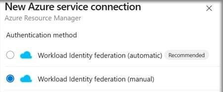
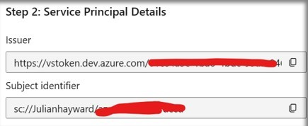
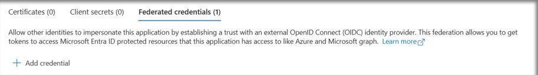

# Configure and run Azure Governance Visualizer from Azure DevOps

Azure DevOps can be used to orchestrate regular execution of Azure Governance Visualizer against your target management group. This allows headless, automated execution along with the ability to set least privileges on the executing account. It uses Azure pipelines as the workflow orchestrator. These instructions will get you up and running from Azure DevOps.

## Prerequisites

- An Azure DevOps account in which you have enough permissions to create a new project.

## 1. Create an Azure DevOps project

[Create an Azure DevOps project](https://learn.microsoft.com/azure/devops/organizations/projects/create-project?view=azure-devops&tabs=browser#create-a-project) to use as the home for the pipelines, artifacts, and service connections.

While you could use an existing one, these instructions are written with a new project in mind. Adjust as needed to use an existing project.

## 2. Import Azure Governance Visualizer GitHub repository

Azure Governance Visualizer clone URL: `https://github.com/JulianHayward/Azure-MG-Sub-Governance-Reporting.git`

Follow the instructions on Microsoft Learn to [Import this repo into a new repo](https://learn.microsoft.com/azure/devops/repos/git/import-git-repository?view=azure-devops#import-into-a-new-repo). The Azure Governance Visualizer GitHub repository is public, so no authorization is required.

## 3. Create Azure DevOps Pipeline service connection

For pipelines to authenticate and connect to Azure you need to create an Azure Resource Manager service connection. This will allow the Azure Governance Visualizer scripts to connect to Azure resources under the identity of a properly permissioned service principal.

There are a few options to create the service connection, both will result in least privilege access:

- **Option 1** - [Use workload identity federation](#option-1---use-workload-identity-federation-recommended) _(This is the recommended option.)_
- **Option 2** - [Create a service principal service connection from Azure DevOps](#option-2---create-a-service-principal-service-connection-from-azure-devops)

### Option 1 - Use workload identity federation (recommended)

This option uses Microsoft Entra workload identity federation to manage a service principal but without the need for you to manage secrets or secret expiration. This is the recommended method.

#### Start the process in Azure DevOps

1. Open your project in [Azure DevOps](http://dev.azure.com/).
1. Click on '**Project settings**' (located on the bottom left)
1. Under '**Pipelines**' click on '**Service Connections**'
1. Click on '**New service connection**' and select the connection/service type '**Azure Resource Manager**' and click '**Next**'
1. Select Authentication method **Workload Identity federation (manual)**

   

1. Give the connection a meaningful name and description.
1. For '**Security**' leave the 'Grant access permissions to all pipelines' option checked (optional)
1. Copy the values of the following results, as you'll need those in the next set of steps for Microsoft Entra configuration.

   - **Issuer**
   - **Subject identifier**

   

#### Continue by creating and configuring an app registration in Microsoft Entra ID

Doing the "manual" path requires jumping over to Microsoft Entra ID to create a service principal before continuing creating the Azure service connection.

1. In a new browser tab, navigate to the [Microsoft Entra admin center](https://entra.microsoft.com/)
1. Click on '**App registrations**'
1. Click on '**New registration**'
1. Name your application (e.g. 'AzureGovernanceVisualizer_SC')
1. Click '**Register**'
1. Your App registration has been created
1. Copy (note) the '**Application (client) ID**', as you'll need it back in Azure DevOps.
1. Under '**Manage**' click on '**Certificates & Secrets**'
1. Click on '**Federated credentials**' and '**Add credential**'
   
1. Paste the values copied in a prior step.
   - **Issuer**
   - **Subject identifier**

   

#### Assign least privileges to the new identity from the Azure portal

1. In the [Azure portal](https://portal.azure.com) proceed to '**Management Groups**', select the scope at which Azure Governance Visualizer will run. This is usually the **Tenant Root Group**.
1. Go to '**Access Control (IAM)**', '**Grant Access**' and '**Add Role Assignment**', select '**Reader**', click '**Next**'
1. Now '**Select Member**', this will be the name of the Application you created above (e.g. 'AzureGovernanceVisualizer_SC').
1. Select '**Next**', '**Review + Assign**'  

#### Complete the process in Azure DevOps

1. Return to the tab with the "New Azure service connection" workflow in [Azure DevOps](http://dev.azure.com/) and pick up where you left off.
1. For the '**Scope level**' select '**Management Group**'
   - In the field '**Management Group Id**' enter the target Azure management group ID
   - In the field '**Management Group Name**' enter the target Azure management group name
1. Under '**Authentication**' in the field '**Service Principal Id**' enter the '**Application (client) ID**' that you noted earlier.
1. For '**Tenant ID**' enter your Microsoft Entra tenant ID.
1. Click on '**Verify and save**'

### Option 2 - Create a service principal service connection from Azure DevOps

This option uses an automatically created service principal, but requires some authentication tweaks to achieve least privilege. The service principal secret that automatically used in this option will expire in three months, after which you need to refresh the service connection.

1. Open your project in [Azure DevOps](http://dev.azure.com/).
1. Click on '**Project settings**' (located on the bottom left)
1. Under '**Pipelines**' click on '**Service connections**'
1. Click on '**New service connection**' and select the connection/service type '**Azure Resource Manager**' and click '**Next**'
1. For the authentication method select '**Service principal (automatic)**' and click '**Next**'
1. For the '**Scope level**' select '**Management Group**', in the Management Group dropdown select the target Management Group (here the Management Group's display names will be shown), in the '**Details**' section apply a Service Connection name and optional give it a description
1. Click '**Save**'
1. A new window will open, authenticate with your administrative account

**Important!** In Azure, on the target management group scope an '**Owner**' Azure RBAC role assignment for the service connection's service principal has been created automatically. This is more permissions than necessary, as the Azure Governance Visualizer only requires '**Reader**' role assignment. This will be corrected in the next steps.

#### Adjust permissions on the service principal from Azure

Create a '**Reader**' Azure RBAC role assignment on the target management group scope for the AzDO service connection's service principal.

```powershell
$objectId = "<objectId of the AzDO service connection's service principal>"
$managementGroupId = "<managementGroupId>"

New-AzRoleAssignment `
-ObjectId $objectId `
-RoleDefinitionName "Reader" `
-Scope /providers/Microsoft.Management/managementGroups/$managementGroupId

Remove-AzRoleAssignment `
-ObjectId $objectId `
-RoleDefinitionName "Owner" `
-Scope /providers/Microsoft.Management/managementGroups/$managementGroupId
```

If you'd like to use the Azure portal instead; follow the instructions on Microsoft Learn to [Assign Azure roles using the Azure portal](https://learn.microsoft.com/azure/role-based-access-control/role-assignments-portal). Grant the service principal the '**Reader**' role on the target management group. Then follow the instructions to [Remove Azure role assignments](https://learn.microsoft.com/azure/role-based-access-control/role-assignments-remove) to remove the automatically assigned '**Owner**' role from the service principal on the target management group.

## 4. Grant Microsoft Graph API permissions in Microsoft Entra ID

The service principal created in the prior step is authorized for Azure resource access, but also must be authorized for Microsoft Entra ID directory querying through Microsoft Graph. The instructions in this step will configure that.

1. Navigate to the [Microsoft Entra admin center](https://entra.microsoft.com/).
1. Click on '**App registrations**'
1. Search for the existing application (service principal)
1. Under '**Manage**' click on '**API permissions**'
1. Click on '**Add a permissions**'
1. Click on '**Microsoft Graph**'
1. Click on '**Application permissions**'
1. Select the following set of permissions and click '**Add permissions**'
   - **Application / Application.Read.All**
   - **Group / Group.Read.All**
   - **User / User.Read.All**
   - **PrivilegedAccess / PrivilegedAccess.Read.AzureResources**
1. Click on 'Add a permissions'
1. Back in the main '**API permissions**' menu you will find permissions with status 'Not granted for...'. Click on '**Grant admin consent for _TenantName_**' and confirm by click on '**Yes**'
   - Now you will find the permissions with status '**Granted for _TenantName_**'

Permissions and admin consent granted in Microsoft Entra ID for the service principal (App Registration):


## 5. Grant permissions on Azure Governance Visualizer Azure DevOps repository

When the Azure pipeline executes the Azure Governance Visualizer script the output from the script should be pushed back to the Azure Governance Visualizer Azure DevOps repository. In order to do this, you need to grant the Azure DevOps project's 'Build Service' account with '**Contribute**' permissions on the repository.

1. Open your project in [Azure DevOps](http://dev.azure.com/).
1. Click on '**Project settings**' (located on the bottom left)
1. Under '**Repos**', click '**Repositories**'.
1. Click on the Azure Governance Visualizer repository and select the tab '**Security**'
1. On the right side search for the 'Build Service' account **%Project name% Build Service (%Organization name%)** and grant it with '**Contribute**' permissions by selecting '**Allow**' (no save button available)

## 6. Configure parameters in the Azure pipeline YAML file

You'll need to modify the '**AzGovViz.variables.yml**' file to work with the service connection you created and to point to your target management group.

> For the '**parameters**' and '**variables**' sections, details about each parameter or variable is documented inline.

1. Open your project in [Azure DevOps](http://dev.azure.com/).
1. Click on '**Repos**'
1. Navigate to the Azure Governance Visualizer repository
1. In the folder '**/.azuredevops/pipelines**' click on '**AzGovViz.variables.yml**' and click '**Edit**'
1. If needed, modify the '**parameters**' section:
   - For more information, see [Runtime parameters](https://learn.microsoft.com/azure/devops/pipelines/process/runtime-parameters).
   - (Optional) Update the '**ExcludedResourceTypesDiagnosticsCapableParameters**'
   - (Optional) Update the '**SubscriptionQuotaIdWhitelistParameters**'
1. Update the '**Required Variables**' section:
   - Replace `<YourServiceConnection>` with the name of the Azure DevOps service connection that you created and configured earlier (ServiceConnection)
   - Replace `<YourManagementGroupId>` with the target Azure management group ID (ManagementGroupId)
1. If needed, update the '**Default Variables**' section
1. If needed, update the '**Optional Variables**' section

## 7. Create the Azure pipeline

1. Open your project in [Azure DevOps](http://dev.azure.com/).
1. Click on '**Pipelines**'
1. Click on '**New pipeline**'
1. Select '**Azure Repos Git**'
1. Select the Azure Governance Visualizer repository
1. Click on '**Existing Azure Pipelines YAML file**'
1. Under '**Path**' select '**/.azuredevops/pipelines/AzGovViz.pipeline.yml**'
1. Click ' **Save**'

## 8. Test the Azure pipeline with a manual run

1. Click on '**Pipelines**'
1. Select the new Azure Governance Visualizer pipeline
1. Click '**Run pipeline**'

> Before the pipeline kicks off it may require you to approve the run. (only first time run)

## 9. Establish an Azure DevOps Wiki (WikiAsCode)

Once the pipeline has executed successfully you can setup your Wiki

1. Click on '**Overview**'
1. Click on '**Wiki**'
1. Click on '**Publish code as wiki**'
1. Select the Azure Governance Visualizer repository
1. Select the folder '**wiki**' and click '**OK**'
1. Enter a name for the Wiki
1. Click '**Publish**'

## Next steps

For report hosting, consider using the [Azure Governance Visualizer accelerator](https://github.com/Azure/Azure-Governance-Visualizer-Accelerator) which will give you an example on how to host the output on Azure Web Apps in conjunction with this Azure DevOps automation.
